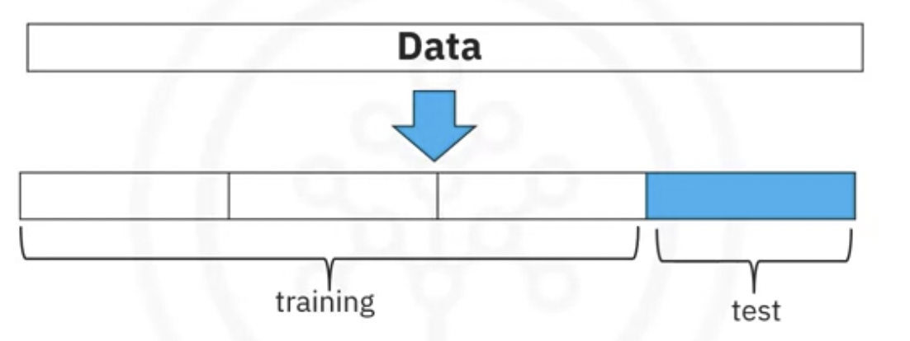
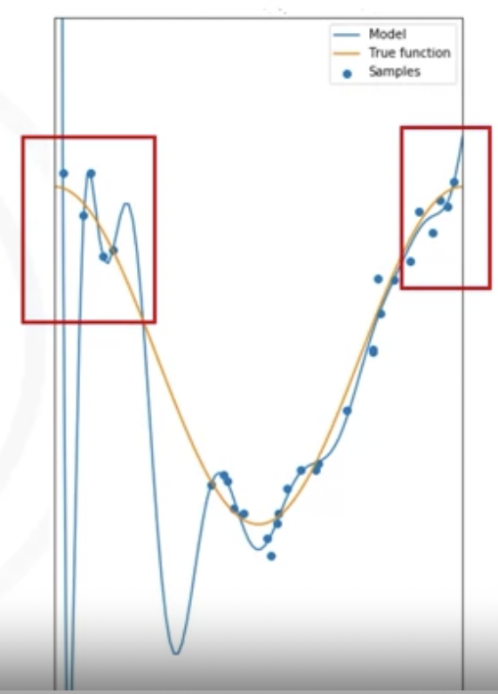
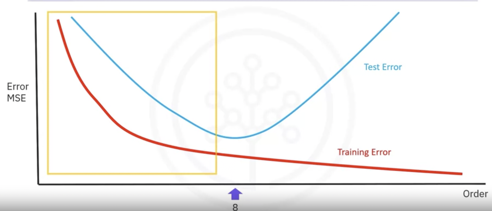

# Data Analysis with Python

## Import Data Sets

| **Package/Method**               | **Description**                                              | **Code Example**                                             |
| -------------------------------- | ------------------------------------------------------------ | ------------------------------------------------------------ |
| Read CSV data set                | Read the CSV file containing a data set to a pandas data frame | `df = pd.read_csv(<CSV_path>, header = None) # load without header df = pd.read_csv(<CSV_path>, header = 0) # load using first row as header `<br/>Note: The labs in this course run in JupyterLite environment. In JupyterLite environment, you'll need to download the required file to the local environment and then use the local path to the file as the CSV_path. However, in case you are using JupyterLabs, or any other Python compiler on your local machine, you can use the URL of the required file directly as the CSV_path. |
| Print **first** few entries      | Print the first few entries (default 5) of the pandas data frame | `df.head(n) #n=number of entries; default 5`                 |
| Print **last** few entries       | Print the last few entries (default 5) of the pandas data frame | `df.tail(n) #n=number of entries; default 5`                 |
| Assign **header names**          | Assign appropriate header names to the data frame            | `df.columns = headers`                                       |
| **Replace** "?" with NaN         | Replace the entries "?" with NaN entry from Numpy library    | `df = df.replace("?", np.nan)`                               |
| Retrieve **data types**          | Retrieve the data types of the data frame columns            | `df.dtypes`                                                  |
| Retrieve statistical description | Retrieve the statistical description of the data set. <u>**Defaults** use is for only **numerical** data types</u>. Use include="all" to create summary for **all variables** | `df.describe() #default use df.describe(include="all")`      |
| Retrieve data set summary        | Retrieve the **summary of the data set** being used, from the data frame | `df.info()`                                                  |
| Save **data frame to CSV**       | Save the processed data frame to a CSV file with a specified path | `df.to_csv(<output CSV path>)`                               |

Type: 

| Pandas Type           | Native Python Type | Description                      |
| --------------------- | ------------------ | -------------------------------- |
| object                | string             | Numbers and strings              |
| int64                 | int                | Numeric characters               |
| float64               | float              | numeric characters with decimals |
| Datetime64, timedelta | N/A                | time data                        |

```python
compression-ratio			float64
horsepower            object
highway-mpg            int64
time data 						Datetime64
```


## Data Wragling

#### Deal with missing data

Check with the data collection source

Drop the missing values

- drop the variable
- drop the data entry

Replace the missing values

- replace it with an average (of similar datapoints)
- replace it by frequency
- replace it based on other functions

Leave it as missing data 


```python
mean = df["normalized-losses"].mean()
df["normalized-losses"].replace(np.nan, mean)
```

### Data Formating

- Bringing data into a common standard of expression allows users to make meaningful comparison

change the value the column:

```python
df["city-mpg"] = 235/df["city-mpg"]
df.rename(columns={"city-mpg": "city-L/100km"}, inplace=True)
```

#### Correcting data types

To identify data types: • Use dataframe .dtypes () to identify data type

To convert data types: • Use dataframe. astype () to convert data type

Example: Convert data type to integer in column "price"

```python
df ["price"] = df ["price"].astype ("int")
```

#### **What is standardization?**

Standardization is the process of transforming data into a **common format,** allowing the researcher to make the meaningful comparison

#### Methods of normalizing data

- to make the range of values consistent and make comparing and analyzing value easier

Several approaches for normalization:

**Simple Feature scaling, Min-Max, Z-score**


```python
df ["length"] = df ["length"] / df ["length"].max()
df ["length"] = (df ["length"]-df ["length"].min()) /(df ["length"].max() - df ["length"].min())
df ["length"] = (df ["length"]-df ["length"].mean()) /df ["length"].std()
```

#### Binning

- Group of values into bins

- Convert numeric data into categorical variables

- Group a set of numerical values into a set of bins 

- Using **Histograms** to visualize the bins


```python
# price: 5000, 10000, 12000, 12000. 30000, 31000, 39000, 44000, 44500
# bins:   low, mid, high
bins = np.linspace(min(df["price"]), max(df["price"]), 4)
group_names = ["Low", "Medium", "High"]
df["price-binned"] = pd.cut(df["price"], bins, labels=group_names, include_lowest=True)
```

### Convert categorical values into Quantitative Variables in Python

Solution:

- Add dummy variables for each unique category
- Assign 0 or 1 in each category

Dummy variables in Python pandas

- Use **pandas.get_dummies()** method.
- Convert categorical variables to dummy variables (0 or 1)

```python
#df['fuel'] >> has two values: gas, diesel
# df['gas']: 1; df['diesel']:0
pd.get_dummies(df['fuel'])
```

## Creating Different Types of Plots

Matplotlib and seaborn

```python
import matplotlib.pyplot as plt

import seaborn as sns

# 1. standard Line Plot
plt.plot(x,y)
# 2. Scatter Plot
plt.scatter(x,y)
# 3. Histogram: 
plt.hist(x, bins, edgecolor="Black")
# 4. Bar plot
plt.bar(x, height)
# 5. color
plt.pcolor(C)

# 1. Regression plot: draws a scatter plot of two variables, x and y. Then fits the regression model and plots the resulting regression line along with a 95% confidence interval for the regression.
sns.regplot(x="header_1", y="header_2", data=df)

# A residual plot is used to display the quality of polynomial regression. This function will regress y on x as a polynomial regression and then draw a scatterplot of the residuals.
sns.residplot(data=df,x='header_1', y='header_2')
sns.residplot(x=df['header_1'], y=df['header_2'])

# KDE plot: a kernel density estimate plot: a graph that creates a probability distribution curve for the data based on its likelihood of occurence on a specific value.
sns.kdeplot(X)

# Distribution Plot: the capacity to combine the histogram and the KDE plots.
sns.distplot(X, hist=False)
```


### Descriptive Statistics

- Describe basic features of data
- Calculate descriptive statistics for your data

### Grouping data

## Exploratory Data Analysis

- Measure the strength of the correlation between two features
  - Correlation coefficient
  - P-value

- Correlation coefficient
  - Close to +1: Large Positive relationship
  - Close to -1: Large Negative relationship
  - Close to 0: No relationship

- P-value
  - P-value < 0.001 Strong certainty in the result
  - P-value < 0.05 Moderate certainty in the result
  - P-value < 0.1 Weak certainty in the result
  
  What range of Pearson Coefficient ‘p’ is considered too high to support any certainty about the correlation of variables? P > 0.1

```python
pearson_coef, p_value = stats.pearsonr (df['horsepower'], df[ 'price'])
# Pearson correlation: 0.81
# P-value: 9.35 e-48
```


Congratulations! You have completed this lesson. At this point in the course, you know: 

- Tools like the **'describe'** function in pandas can quickly calculate key statistical measures like mean, standard deviation, and quartiles for all numerical variables in your data frame. 
- Use the **'value_counts'** function to summarize data into different categories for categorical data. 
- Box plots offer a more visual representation of the data's distribution for numerical data, indicating features like the median, quartiles, and outliers.
- Scatter plots are excellent for exploring relationships between continuous variables, like engine size and price, in a car data set.
- Use Pandas' **'groupby'** method to explore relationships between categorical variables.
- Use pivot tables and heat maps for better data visualizations.
- Correlation between variables is a statistical measure that indicates how the changes in one variable might be associated with changes in another variable.
- When exploring correlation, use scatter plots combined with a regression line to visualize relationships between variables.
- Visualization functions like **regplot,** from the **seaborn** library, are especially useful for exploring correlation.
- The **Pearson correlation**, a key method for assessing the correlation between continuous numerical variables, provides two critical values—the coefficient, which indicates the strength and direction of the correlation, and the P-value, which assesses the certainty of the correlation.
- A correlation coefficient close to 1 or -1 indicates a strong positive or negative correlation, respectively, while one close to zero suggests no correlation.
- For P-values, values less than .001 indicate strong certainty in the correlation, while larger values indicate less certainty. Both the coefficient and P-value are important for confirming a strong correlation.
- Heatmaps provide a comprehensive visual summary of the strength and direction of correlations among multiple variables.


## Cheat Sheet: Exploratory Data Analysis

| Package/Method                  | Description                                                  | Code Example                                                 |
| ------------------------------- | ------------------------------------------------------------ | ------------------------------------------------------------ |
| Complete dataframe correlation  | Correlation matrix created using **all the attributes** of the dataset. | ` df.corr() `                                                |
| Specific Attribute correlation  | Correlation matrix created using **specific attributes** of the dataset. | ` df[['attribute1','attribute2',...]].corr() `               |
| Scatter Plot                    | Create a scatter plot using the data points                  | ` from matlplotlib import pyplot as plt plt.scatter(df[['attribute_1']],df[['attribute_2']]) ` |
| Regression Plot                 | create a scatter plot with a generated **linear regression line** for the data. | ` import seaborn as sns sns.regplot(x='attribute_1',y='attribute_2', data=df) ` |
| Box plot                        | Create a box-and-whisker plot that uses the pandas dataframe | ` import seaborn as sns sns.boxplot(x='attribute_1',y='attribute_2', data=df) ` |
| Grouping by attributes          | create a subset of the data.                                 | ` df_group = df[['attribute_1','attribute_2',...]] `         |
| GroupBy statements              | a. Group the data by different categories of **an attribute**, | `df_group = df_group.groupby(['attribute_1'],as_index=False).mean()  ` <br>`df_group = df_group.groupby(['attribute_1', 'attribute_2'],as_index=False).mean()` |
| Pivot Tables                    | Create **Pivot tables** for better representation of data based on parameters | `grouped_pivot = df_group.pivot(index='attribute_1',columns='attribute_2') ` |
| Pseudocolor plot                | Create a **heatmap** image using a **PsuedoColor**           | ` from matlplotlib import pyplot as plt plt.pcolor(grouped_pivot, cmap='RdBu') ` |
| Pearson Coefficient and p-value | Calculate the Pearson Coefficient and p-value of a pair of attributes | `From scipy import stats pearson_coef,p_value=stats.pearsonr(df['attribute_1'], df['attribute_2']) ` |

### Cross Validation

- Most common out-of-sample evaluation metrics
- More effective use of data (each observation is used for both training and testing)



```python
from sklearn.model_selection import cross_val_score
scores = cross_val_score(lr, x_data, y_data, cv=3)
np.mean(scores)
```

#### What is the purpose of “folding” your data sets?

The purpose of "folding" or using **cross-validation techniques** with your data sets is to assess the performance and generalizability of a predictive model. Cross-validation involves partitioning the data into subsets, training the model on some of these subsets, and then evaluating its performance on the remaining data. This process is repeated multiple times, and the results are averaged. (Reduce overfitting)


R square: When R Square is close to 1, it indicates that a high percentage of the variability in the dependent variable is explained by the independent variables in the regression model. In other words, the model fits the data well,

### Underfitting and Overfitting

```python
# a good fit for the model
y_hat = bo + b1x + b2x^2 + .... b8x^8
```




### Model Selection



```python
Rsqu_test = []
order = [1,2,3,4]
for n in order:
  pr = PolynomialFeatures(degree=n)
  x_train_pr = pr.fit_transform(x_train[['horsepower']])
  x_test_pr = pr.fit_transform(x_test[['horsepower']])
  lr.fit(x_train_pr, y_train)
  Rsqu_test.append(lr.score(x_test_pr, y_test))
```

GirdSearchCV

### Final exam

[Skip to Main Content](https://www.coursera.org/learn/data-analysis-with-python/assignment-submission/r4Iys/final-exam/view-feedback#main)

![Coursera](data:image/svg+xml;base64,PD94bWwgdmVyc2lvbj0iMS4wIiBlbmNvZGluZz0idXRmLTgiPz4KPCEtLSBHZW5lcmF0b3I6IEFkb2JlIElsbHVzdHJhdG9yIDE2LjIuMCwgU1ZHIEV4cG9ydCBQbHVnLUluIC4gU1ZHIFZlcnNpb246IDYuMDAgQnVpbGQgMCkgIC0tPgo8IURPQ1RZUEUgc3ZnIFBVQkxJQyAiLS8vVzNDLy9EVEQgU1ZHIDEuMS8vRU4iICJodHRwOi8vd3d3LnczLm9yZy9HcmFwaGljcy9TVkcvMS4xL0RURC9zdmcxMS5kdGQiPgo8c3ZnIHZpZXdCb3g9IjAgMCAxMTU1IDE2NCIgeG1sbnM9Imh0dHA6Ly93d3cudzMub3JnLzIwMDAvc3ZnIiBmaWxsLXJ1bGU9ImV2ZW5vZGQiIGNsaXAtcnVsZT0iZXZlbm9kZCIgc3Ryb2tlLWxpbmVqb2luPSJyb3VuZCIgc3Ryb2tlLW1pdGVybGltaXQ9IjIiPjxwYXRoIGQ9Ik0xNTkuNzUgODEuNTRjMC00NC40OSAzNi42My04MC40NyA4Mi40My04MC40NyA0Ni4xMiAwIDgyLjc2IDM2IDgyLjc2IDgwLjQ3IDAgNDQuMTYtMzYuNjQgODAuOC04Mi43NiA4MC44LTQ1LjggMC04Mi40My0zNi42OC04Mi40My04MC44em0xMjUuNjEgMGMwLTIyLjI0LTE5LjMtNDEuODctNDMuMTgtNDEuODctMjMuNTUgMC00Mi44NSAxOS42My00Mi44NSA0MS44NyAwIDIyLjU3IDE5LjMgNDIuMiA0Mi44NSA0Mi4yIDIzLjkyIDAgNDMuMTgtMTkuNjMgNDMuMTgtNDIuMnptNzA1LjYzIDEuMzFjMC00OC43NCAzOS41OC04MS43OCA3NS41Ny04MS43OCAyNC41MyAwIDM4LjYgNy41MiA0OC4wOCAyMS45MmwzLjc3LTE5aDM2Ljc5djE1NS40aC0zNi43OWwtNC43NS0xNmMtMTAuNzkgMTEuNzgtMjQuMjEgMTktNDcuMSAxOS0zNS4zMy0uMDUtNzUuNTctMzEuMTMtNzUuNTctNzkuNTR6bTEyNS42MS0uMzNjLS4wOS0yMy41MjctMTkuNDctNDIuODM1LTQzLTQyLjgzNS0yMy41OSAwLTQzIDE5LjQxMS00MyA0M3YuMTY1YzAgMjEuNTkgMTkuMyA0MC44OSA0Mi44NiA0MC44OSAyMy44NSAwIDQzLjE0LTE5LjMgNDMuMTQtNDEuMjJ6TTk0NS43OCAyMlY0aC00MC4yM3YxNTUuMzloNDAuMjNWNzUuNjZjMC0yNS4xOSAxMi40NC0zOC4yNyAzNC0zOC4yNyAxLjQzIDAgMi43OS4xIDQuMTIuMjNMOTkxLjM2LjExYy0yMC45Ny4xMS0zNi4xNyA3LjMtNDUuNTggMjEuODl6bS00MDQuMjcuMDF2LTE4bC00MC4yMy4wOS4zNCAxNTUuMzcgNDAuMjMtLjA5LS4yMi04My43MmMtLjA2LTI1LjE4IDEyLjM1LTM4LjI5IDMzLjkzLTM4LjM0IDEuMzc2LjAwNCAyLjc1Mi4wODEgNC4xMi4yM0w1ODcuMSAwYy0yMSAuMTctMzYuMjIgNy4zOS00NS41OSAyMi4wMXpNMzM4Ljg4IDk5LjJWNC4wMWg0MC4yMlY5NC4zYzAgMTkuOTUgMTEuMTIgMzEuNzMgMzAuNDIgMzEuNzMgMjEuNTkgMCAzNC0xMy4wOSAzNC0zOC4yOFY0LjAxaDQwLjI0djE1NS4zOGgtNDAuMjF2LTE4Yy05LjQ4IDE0LjcyLTI0Ljg2IDIxLjkyLTQ2LjEyIDIxLjkyLTM1Ljk4LjAxLTU4LjU1LTI2LjE2LTU4LjU1LTY0LjExem0zOTEuNzQtMTcuNDhjLjA5LTQzLjUxIDMxLjIzLTgwLjc0IDgwLjYyLTgwLjY1IDQ1LjguMDkgNzguMTEgMzYuNzggNzggODAgLjAxIDQuMjczLS4zMyA4LjU0LTEgMTIuNzZsLTExOC40MS0uMjJjNC41NCAxOC42NSAxOS44OSAzMi4wOSA0My4xMiAzMi4xNCAxNC4wNiAwIDI5LjEyLTUuMTggMzguMy0xNi45NGwyNy40NCAyMmMtMTQuMTEgMTkuOTMtMzkgMzEuNjYtNjUuNDggMzEuNjEtNDYuNzUtLjE2LTgyLjY3LTM1LjIzLTgyLjU5LTgwLjd6bTExOC4xMi0xNi4xNGMtMi4yNi0xNS43LTE4LjU5LTI3Ljg0LTM3Ljg5LTI3Ljg3LTE4LjY1IDAtMzMuNzEgMTEuMDYtMzkuNjMgMjcuNzNsNzcuNTIuMTR6bS0yNjEuNCA1OS45NGwzNS43Ni0xOC43MmM1LjkxIDEyLjgxIDE3LjczIDIwLjM2IDM0LjQ4IDIwLjM2IDE1LjQzIDAgMjEuMzQtNC45MiAyMS4zNC0xMS44MiAwLTI1LTg0LjcxLTkuODUtODQuNzEtNjcgMC0zMS41MiAyNy41OC00OC4yNiA2MS43Mi00OC4yNiAyNS45NCAwIDQ4LjkyIDExLjQ5IDYxLjQgMzIuODNsLTM1LjQ0IDE4Ljc1Yy01LjI1LTEwLjUxLTE1LjEtMTYuNDItMjcuNTgtMTYuNDItMTIuMTQgMC0xOC4wNiA0LjI3LTE4LjA2IDExLjQ5IDAgMjQuMyA4NC43MSA4Ljg3IDg0LjcxIDY3IDAgMzAuMjEtMjQuNjIgNDguNTktNjQuMzUgNDguNTktMzMuODItLjAzLTU3LjQ2LTExLjE5LTY5LjI3LTM2Ljh6TTAgODEuNTRDMCAzNi43MyAzNi42My43NCA4Mi40My43NGMyNy45NDctLjE5NiA1NC4xODIgMTMuNzM3IDY5LjY3IDM3bC0zNC4zNCAxOS45MmE0Mi45NzIgNDIuOTcyIDAgMDAtMzUuMzMtMTguMzJjLTIzLjU1IDAtNDIuODUgMTkuNjMtNDIuODUgNDIuMiAwIDIyLjU3IDE5LjMgNDIuMiA0Mi44NSA0Mi4yYTQyLjUwMiA0Mi41MDIgMCAwMDM2LjMxLTIwbDM0IDIwLjI4Yy0xNS4zMDcgMjMuOTU1LTQxLjkwMiAzOC40MzEtNzAuMzMgMzguMjhDMzYuNjMgMTYyLjM0IDAgMTI1LjY2IDAgODEuNTR6IiBmaWxsPSIjMDA1NkQyIiBmaWxsLXJ1bGU9Im5vbnplcm8iLz48L3N2Zz4=)

SEARCH IN COURSE

Search


- English
- 
- 

Hide menu

- ## Practice Project

- ## Final Project

- ## Final Exam

  - 

    **Reading:** ReadingCheat Sheet: Data Analysis for Python

    . Duration: 10 minutes10 min

  - 

    **Graded Assignment:** Final Exam

    . Duration: 1 hour1h

- ## Digital Badge

- ## Acknowledgments

[Week 6](https://www.coursera.org/learn/data-analysis-with-python/home/week/6)Final Exam

[Previous](https://www.coursera.org/learn/data-analysis-with-python/supplement/bpRFD/cheat-sheet-data-analysis-for-python)[Next](https://www.coursera.org/learn/data-analysis-with-python/supplement/hqeqX/ibm-digital-badge)

# Final Exam

### Assignment details

#### Due

December 10, 11:59 PM ESTDec 10, 11:59 PM EST

#### Submitted

November 14, 10:56 AM ESTNov 14, 10:56 AM EST

#### Attempts

2 left (3 attempts every 24 hours)

#### Time limit


00:30:38 remaining

Time remaining: 30 minutes and 38 seconds


Edit

### Your grade

To pass you need at least 70%. We keep your highest score.

85%

View submission

See feedback

Like

Dislike

Report an issue

Chat with us

# Final Exam

Graded Assignment • 1h

DueDec 10, 11:59 PM EST

## Your grade: 85%

### 9.

Which statement about binning is true?

It is primarily used to gain a better understanding of the data distribution.(correct)

It is primarily used to calculate descriptive statistics.

It is primarily used to normalize the data.

It is primarily used to format the data.

Incorrect

Incorrect. Review the video Binning in Python.

### 19.

Question 19

Say you have several differently ordered polynomial models. Which of the following statistics will best help you decide which model to use?

Mean-squared error

Alpha (when alpha=10, too big-under fitting; alpha=0, too small, overfitting)

Correlation coefficient

Coefficient of determination

Incorrect

Incorrect. Review the video Ridge Regression.

### 10.

What is the primary purpose of standardizing a set of values?

It places different variables on the same scale, allowing you to compare them more easily.

Correct! Standardizing values serves to place different variables on the same scale, allowing you to compare them more easily.

### 11.

 A negative linear relationship between an input variable and an output variable implies that as the input increases, the output decreases at about the same rate.

### 14.

Question 14

Outliers on a boxplot are usually calculated how?

1.5 times the interquartile range added to the 75th quartile and subtracted from the 25th quartile

Outliers on a boxplot are usually calculated as 1.5 times the interquartile range added to the 75th quartile and subtracted from the 25th quartile.

### 16.

Say you are trying to predict the price of a car based on its gas mileage, and you find an equation in terms of  and *x* to *y_hat* predict these values. What is this equation called? A mathematical equation with an input variable and an output variable used to predict values is called a model estimator.

### 17.

How are residuals calculated? : y_predict - y

### 18.

Question 18

What is true about noise in the data? It is random and cannot be predicted.

### 20.

Question 20

What is one of the arguments of the GridSearchCV() method?

1 / 1 point

The normalized input values from your data set.

A Python dictionary with the key-value pair of the hyperparameter and a list of its possible values.

A data frame containing different possible models and their R2 values.

A Python dictionary where the key is the column header of your data set, and the values are the different values in that column.

Correct

Correct! One of the arguments of the GridSearchCV() method is a Python dictionary with the key-value pair of the hyperparameter and a list of its possible values.
