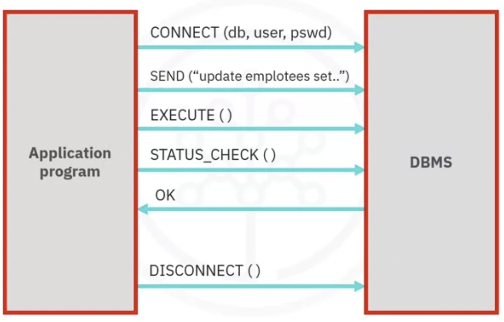
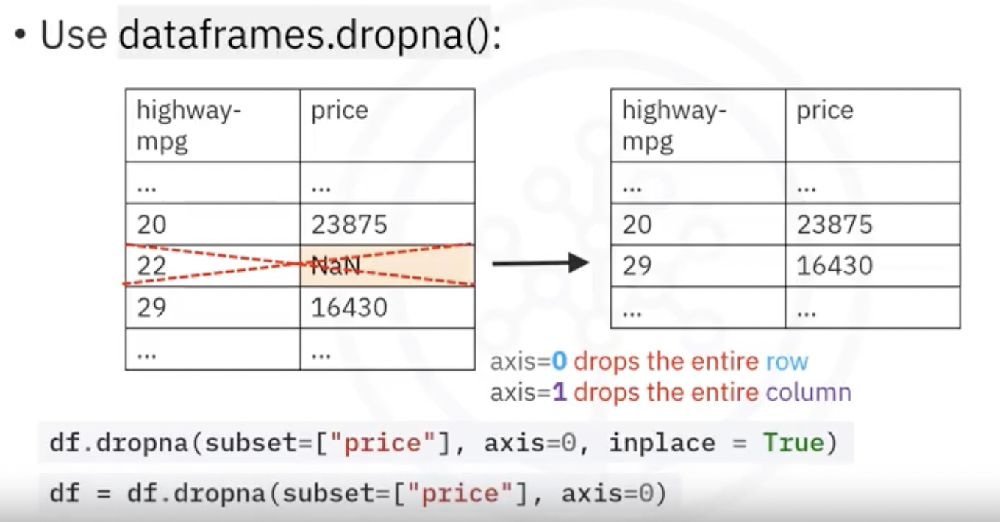
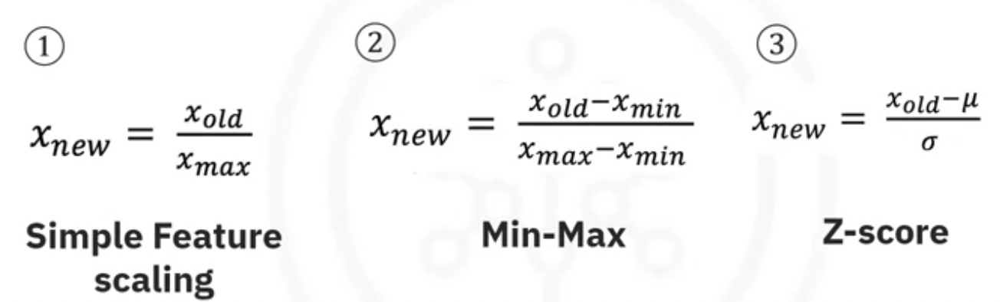
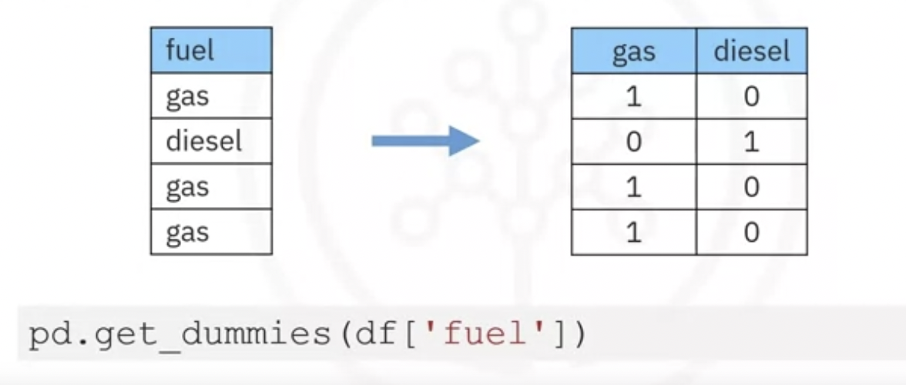

# Data Analysis with Python

## Cheat Sheet: Importing Data Sets

| **Package/Method**               | **Description**                                              | **Code Example**                                             |
| -------------------------------- | ------------------------------------------------------------ | ------------------------------------------------------------ |
| Read CSV data set                | Read the CSV file containing a data set to a pandas data frame | `df = pd.read_csv(<CSV_path>, header = None) # load without header df = pd.read_csv(<CSV_path>, header = 0) # load using first row as headerCopied!`<br/>Note: The labs in this course run in JupyterLite environment. In JupyterLite environment, you'll need to download the required file to the local environment and then use the local path to the file as the CSV_path. However, in case you are using JupyterLabs, or any other Python compiler on your local machine, you can use the URL of the required file directly as the CSV_path. |
| Print **first** few entries      | Print the first few entries (default 5) of the pandas data frame | `df.head(n) #n=number of entries; default 5`                 |
| Print **last** few entries       | Print the last few entries (default 5) of the pandas data frame | `df.tail(n) #n=number of entries; default 5`                 |
| Assign **header names**          | Assign appropriate header names to the data frame            | `df.columns = headers`                                       |
| **Replace** "?" with NaN         | Replace the entries "?" with NaN entry from Numpy library    | `df = df.replace("?", np.nan)`                               |
| Retrieve **data types**          | Retrieve the data types of the data frame columns            | `df.dtypes`                                                  |
| Retrieve statistical description | Retrieve the statistical description of the data set. <u>**Defaults** use is for only **numerical** data types</u>. Use include="all" to create summary for **all variables** | `df.describe() #default use df.describe(include="all")`      |
| Retrieve data set summary        | Retrieve the **summary of the data set** being used, from the data frame | `df.info()`                                                  |
| Save **data frame to CSV**       | Save the processed data frame to a CSV file with a specified path | `df.to_csv(<output CSV path>)`                               |

Type: 

| Pandas Type           | Native Python Type | Description                      |
| --------------------- | ------------------ | -------------------------------- |
| object                | string             | Numbers and strings              |
| int64                 | int                | Numeric characters               |
| float64               | float              | numeric characters with decimals |
| Datetime64, timedelta | N/A                | time data                        |

```python
compression-ratio			float64
horsepower            object
highway-mpg            int64
time data 						Datetime64
```





### Data Wragling

#### Deal with missing data

Check with the data collection source

Drop the missing values

- drop the variable
- drop the data entry

Replace the missing values

- replace it with an average (of similar datapoints)
- replace it by frequency
- replace it based on other functions

Leave it as missing data 



```python
mean = df["normalized-losses"].mean()
df["normalized-losses"].replace(np.nan, mean)
```

### Data Formating

- Bringing data into a common standard of expression allows users to make meaningful comparison

change the value the column:

```python
df["city-mpg"] = 235/df["city-mpg"]
df.rename(columns={"city-mpg": "city-L/100km"}, inplace=True)
```

#### Correcting data types

To identify data types: • Use dataframe .dtypes () to identify data type

To convert data types: • Use dataframe. astype () to convert data type

Example: Convert data type to integer in column "price"

```python
df ["price"] = df ["price"].astype ("int")
```

#### **What is standardization?**

Standardization is the process of transforming data into a **common format,** allowing the researcher to make the meaningful comparison

#### Methods of normalizing data

- to make the range of values consistent and make comparing and analyzing value easier

Several approaches for normalization:

**Simple Feature scaling, Min-Max, Z-score**



```python
df ["length"] = df ["length"] / df ["length"].max()
df ["length"] = (df ["length"]-df ["length"].min()) /(df ["length"].max() - df ["length"].min())
df ["length"] = (df ["length"]-df ["length"].mean()) /df ["length"].std()
```

#### Binning

- Group of values into bins

- Convert numeric data into categorical variables

- Group a set of numerical values into a set of bins 

- Using **Histograms** to visualize the bins


```python
# price: 5000, 10000, 12000, 12000. 30000, 31000, 39000, 44000, 44500
# bins:   low, mid, high
bins = np.linspace(min(df["price"]), max(df["price"]), 4)
group_names = ["Low", "Medium", "High"]
df["price-binned"] = pd.cut(df["price"], bins, labels=group_names, include_lowest=True)
```

### Convert categorical values into Quantitative Variables in Python

Solution:

- Add dummy variables for each unique category
- Assign 0 or 1 in each category

Dummy variables in Python pandas

- Use **pandas.get_dummies()** method.
- Convert categorical variables to dummy variables (0 or 1)

```python
#df['fuel'] >> has two values: gas, diesel
# df['gas']: 1; df['diesel']:0
pd.get_dummies(df['fuel'])
```

## Creating Different Types of Plots

Matplotlib and seaborn

```python
import matplotlib.pyplot as plt

import seaborn as sns

# 1. standard Line Plot
plt.plot(x,y)
# 2. Scatter Plot
plt.scatter(x,y)
# 3. Histogram: 
plt.hist(x, bins, edgecolor="Black")
# 4. Bar plot
plt.bar(x, height)
# 5. color
plt.pcolor(C)

# 1. Regression plot: draws a scatter plot of two variables, x and y. Then fits the regression model and plots the resulting regression line along with a 95% confidence interval for the regression.
sns.regplot(x="header_1", y="header_2", data=df)

# A residual plot is used to display the quality of polynomial regression. This function will regress y on x as a polynomial regression and then draw a scatterplot of the residuals.
sns.residplot(data=df,x='header_1', y='header_2')
sns.residplot(x=df['header_1'], y=df['header_2'])

# KDE plot: a kernel density estimate plot: a graph that creates a probability distribution curve for the data based on its likelihood of occurence on a specific value.
sns.kdeplot(X)

# Distribution Plot: the capacity to combine the histogram and the KDE plots.
sns.distplot(X, hist=False)
```


### Descriptive Statistics

- Describe basic features of data
- Calculate descriptive statistics for your data

### Grouping data

