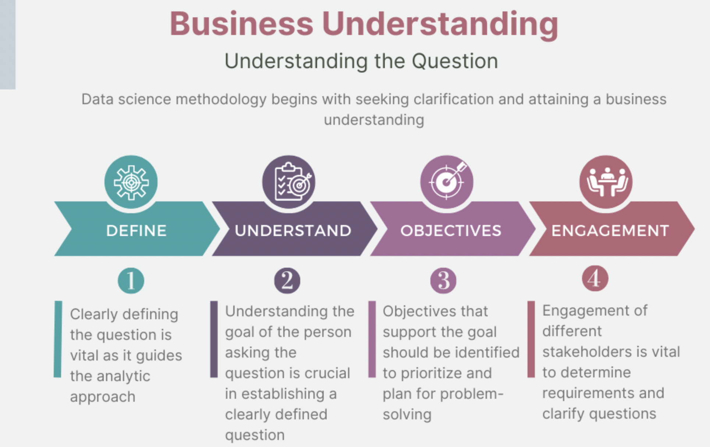
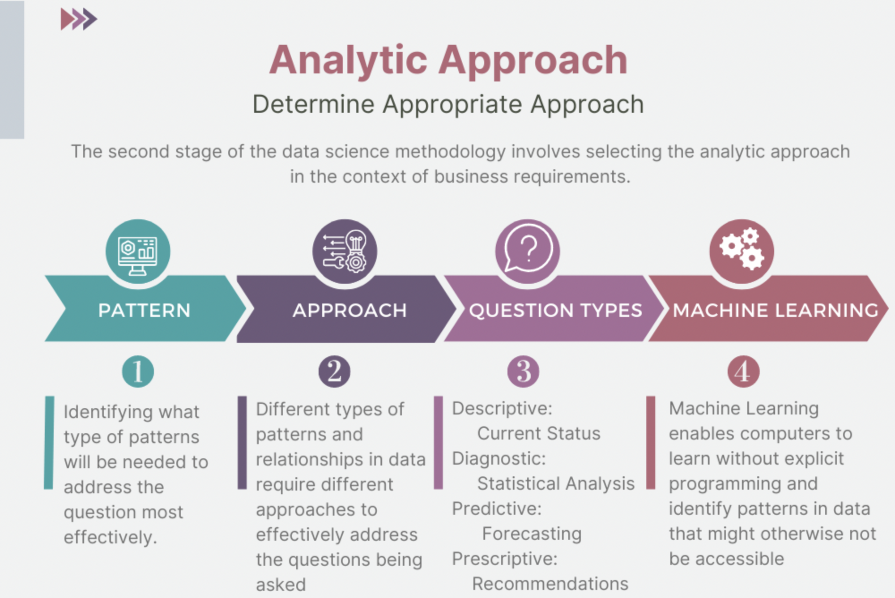

# Data Science Methodology

### Business Understanding and Analytics Approach

The primary goal of the **Business Understanding** stage is to understand the business problem and determine the data needed to answer the core business question.

During the **Analytic Approach** stage, you can choose from descriptive, diagnostic, predictive, and prescriptive analytic approaches, whether to use machine learning with clustering associations.

### Data Requirements and Data Collection

- Data Requirements stage tasks include identifying the correct and necessary data content, data formats, and data sources for the specific analytical approach.
- During the Data Collection stage, expert data scientists meticulously revise data requirements and make critical decisions regarding the quantity and quality of data.

## Data Understanding and Preparation

- The Data Understanding stage encompasses all activities related to constructing the data set and answers the question as to whether the data you collected represents the problem to be solved.
- During the Data Understanding stage, scientists might use descriptive statistics, predictive statistics, or both.
- Data scientists commonly apply Hurst, univariates, and other statistics on each variable, such as mean, median, minimum, maximum, standard deviation, pairwise correlation, and histograms.
- Data scientists also use univariates, statistics, and histograms to assess data quality.

- During the Data Preparation stage, data scientists must address missing or invalid values, remove duplicates, and validate that the data is properly formatted.
- Feature engineering, also part of the Data Preparation stage, uses domain knowledge of the data to create features that make the machine learning algorithms work.
- Text analysis during the Data Preparation stage is critical for validating that the proper groupings are set and that the programming is not overlooking hidden data.

## Modeling to Evaluation

**Model evaluation can have two main phases**. 

- **diagnostic measures phase**: to ensure the model is working as intended. 

If the model is a **predictive** model, a decision tree can be used to evaluate if the answer the model can output, is aligned to the initial design. It can be used to see where there are areas that require adjustments. 

If the model is a **descriptive** model, one in which **relationships** are being assessed, then <u>a testing set with known outcomes</u> can be applied, and the model can be refined as needed. 

- **statistical significance testing** : to ensure that the data is being properly handled and interpreted within the model.

#### ROC

The ROC curve is a useful **diagnostic** tool in determining the optimal classification model. 

This curve quantifies how well **a binary classification model performs**, declassifying the yes and no outcomes when some discrimination criterion is varied. The criterion is a relative misclassification cost. 

Diagnostic tool for classification model evaluation

- Classification model performance
- True-Positive Rate vs False-Positive Rate
- Optimal model at maximum separation

Q:

1. What is the main purpose of data modeling in the data science methodology? To develop models for descriptive or predictive purpose
2. How does a training set contribute to predictive modeling?
3. What does the ROC curve help determine in model evaluation?The **true-positive rate and false-positive** rate for different criteria. The ROC curve helps visualize the performance of a binary classification model by showing how well it classifies positive and negative outcomes.

- The end goal of the Modeling stage is that the data model answers the business question.
- The data modeling process uses a training data set. Data scientists test multiple algorithms on the training set data to determine whether the variables are required and whether the data supports answering the business question. The outcome of those models are either descriptive or predictive.

Quiz:

- **Storytelling** helps to **communicate insights and results effectively** to non-technical stakeholders. Storytelling is crucial to data and analytics. 
- DS methodology (how) ensure continuous improvement: by incorporating feedback and making adjustments.
- how DS refine the model after the initial deployment and feedback stages?

## Deployment to Feedback

- Stakeholders, including the solution owner, marketing staff, application developers, and IT administration evaluate the model and contribute feedback.
- During the Deployment stage, data scientists release the data model to a targeted group of stakeholders.
- Stakeholder and user feedback help assess the model's performance and impact during the Feedback stage.
- The model's value depends on iteration; that is, how successfully the data model incorporates user feedback.

## CRISP-DM

CRISP-DM is An acronym for **Cross-Industry Standard Process for Data Mining**

- A structured approach to guide data-driven decision-making

The CRISP-DM model includes 6 stages:

- Data mining stages
- Data mining stage descriptions
- Explanations of the relationships between tasks and stages

CRISP-DM model includes 6 stages:

- **The Business Understanding stage**:

  - Sets and outlines the project's data analysis intentions and goals

  - Requires communication and clarity to overcome stakeholders' differing objectives, biases, and information modalities

  - Is necessary to avoid wasted time and resources

- **Data Understanding stage**:

  - CRISP-DM combines the stages of <u>Data Requirements, Data Collection, and Data Understanding</u>

  - Data scientists decide on data sources and acquire data

- **Data Preparation stage**

  - Transform data; Determine if more data is needed ; Question missing and ambiguous data values

- **The Modeling stage**: 

  - Reveals **patterns and structure** within the data; Provides **knowledge and insights** that address the stated business problem and goals

- **The Evaluation stage**:

  - **Test** the selected module, **Assess** the model's **effectiveness**, Results determine the model's efficacy

- **The Deployment stage**:

  - Use the data model on **new data** outside of the data set
  - Analyze the results to determine the need for new variables, a new data set, or a new model

# Course Summary

After completing this course, you learned many facts about data science methodology. Here are 14 key, high-level takeaway facts you’ll want to remember from this course.

- Foundational methodology, a cyclical, iterative data science methodology developed by John Rollins, consists of 10 stages, starting with Business Understanding and ending with Feedback.
- CRISP-DM, an open source data methodology, combines several data-related methodology stages into one stage and omits the Feedback stage resulting in a six-stage data methodology.
- The primary goal of the **Business Understanding** stage is to <u>understand the business problem and determine the data needed</u> to answer the core business question. 
- During the **Analytic Approach stage**, you can <u>choose from descriptive diagnostic, predictive, and prescriptive analytic approaches</u> and whether to use machine learning techniques.
- During the **Data Requirements stage**, scientists <u>identify the correct and necessary data</u> content, formats, and sources needed for the specific analytical approach.
- During the **Data Collection stage**, expert data scientists **revise data** requirements and make critical decisions regarding the quantity and quality of data. Data scientists <u>apply descriptive statistics and visualization techniques</u> to thoroughly assess the content, quality, and initial insights gained from the collected data, identify gaps, and determine if new data is needed, or if they should substitute existing data.
- The **Data Understanding stage** encompasses all activities related to constructing the data set. This stage answers the question of <u>whether the collected data represents the data needed to solve the business problem</u>. Data scientists might use descriptive statistics, predictive statistics, or both.
- Data scientists commonly apply Hurst, univariates, and statistics such as mean, median, minimum, maximum, standard deviation, pairwise correlation, and histograms. 
- During the **Data Preparation stage**, data scientists must <u>address missing or invalid values</u>, remove duplicates, and validate that the data is properly formatted. <u>Feature engineering and text analysis</u> are key techniques data scientists apply to validate and analyze data during the Data Preparation stage.
- The end goal of **the Modeling stage** is that the data model answers the business question. During the Modeling stage, data scientists use a training data set. Data scientists **test** multiple algorithms on the training set data to determine whether the variables are required and whether the data supports answering the business question. The outcome of those models is either descriptive or predictive. 
- **The Evaluation stage** consists of two phases, the diagnostic measures phase, and the statistical significance phase. Data scientists and others assess the quality of the model and determine if the model answers the initial Business Understanding question or if the data model needs adjustment. 
- During **the Deployment stage**, data scientists release the data model to a targeted group of stakeholders, including solution owners, marketing staff, application developers, and IT administration., 
- During **the Feedback stage**, stakeholders and users evaluate the model and contribute feedback to assess the model’s performance. 
- The data model’s value depends on its ability to iterate; that is, how successfully the data model incorporates user feedback.

## Glossary

Welcome! This alphabetized glossary contains many of the terms you'll find within this lesson. These terms are important for you to recognize when working in the industry, when participating in user groups, and when participating in other certificate programs.

| **Term**                       | **Definition**                                               |
| ------------------------------ | ------------------------------------------------------------ |
| **Browser-based application**  | An application that users access through a web browser, typically on a tablet or other mobile device, to provide easy access to the model's insights. |
| **Cyclical methodology**       | An iterative approach to the data science process, where each stage informs and refines the subsequent stages. |
| **Data collection refinement** | The process of obtaining additional data elements or information to improve the model's performance. |
| **Data science model**         | The result of data analysis and modeling that provides answers to specific questions or problems. |
| **Feedback**                   | The process of obtaining input and comments from users and stakeholders to refine and improve the data science model. |
| **Model refinement**           | The process of adjusting and improving the data science model based on user feedback and real-world performance. |
| **Redeployment**               | The process of implementing a refined model and intervention actions after incorporating feedback and improvements. |
| **Review process**             | The systematic assessment and evaluation of the data science model's performance and impact. |
| **Solution deployment**        | The process of implementing and integrating the data science model into the business or organizational workflow. |
| **Solution owner**             | The individual or team responsible for overseeing the deployment and management of the data science solution. |
| **Stakeholders**               | Individuals or groups with a vested interest in the data science model's outcome and its practical application, such as solution owners, marketing, application developers, and IT administration. |
| **Storytelling**               | Storytelling is the art of conveying your message, or ideas through a narrative structure that engages, entertains, and resonates with the audience. |
| **Test environment**           | A controlled setting where the data science model is evaluated and refined before full-scale implementation. |

Welcome! This alphabetized glossary contains many of the terms you'll find within this lesson. These terms are important for you to recognize when working in the industry, when participating in user groups, and when participating in other certificate programs.

| **Term**                                                | **Definition**                                               |
| ------------------------------------------------------- | ------------------------------------------------------------ |
| **Binary classification model**                         | A model that classifies data into two categories, such as yes/no or stop/go outcomes. |
| **Data compilation**                                    | The process of gathering and organizing data required for modeling. |
| **Data modeling**                                       | The stage in the data science methodology where data scientists develop models, either descriptive or predictive, to answer specific questions. |
| **Descriptive model**                                   | A type of model that examines relationships between variables and makes inferences based on observed patterns. |
| **Diagnostic measure based tuning**                     | The process of fine-tuning the model by adjusting parameters based on diagnostic measures and performance indicators. |
| **Diagnostic measures**                                 | The evaluation of a model's performance of a model to ensure that the model functions as intended. |
| **Discrimination criterion**                            | A measure used to evaluate the performance of the model in classifying different outcomes. |
| **False-positive rate**                                 | The rate at which the model incorrectly identifies negative outcomes as positive. |
| **Histogram**                                           | A graphical representation of the distribution of a dataset, where the data is divided into intervals or bins, and the height of each bar represents the frequency or count of data points falling within that interval. |
| **Maximum separation**                                  | The point where the ROC curve provides the best discrimination between true-positive and false-positive rates, indicating the most effective model. |
| **Model evaluation**                                    | The process of assessing the quality and relevance of the model before deployment. |
| **Optimal model**                                       | The model that provides the maximum separation between the ROC curve and the baseline, indicating higher accuracy and effectiveness. |
| **Receiver Operating Characteristic (ROC)**             | Originally developed for military radar, the military used this statistical curve to assess the performance of binary classification models. |
| **Relative misclassification cost**                     | This measurement is a parameter in model building used to tune the trade-off between true-positive and false-positive rates. |
| **ROC curve (Receiver Operating Characteristic curve)** | A diagnostic tool used to determine the optimal classification model's performance. |
| **Separation**                                          | Separation is the degree of discrimination achieved by the model in correctly classifying outcomes. |
| **Statistical significance testing**                    | Evaluation technique to verify that data is appropriately handled and interpreted within the model. |
| **True-positive rate**                                  | The rate at which the model correctly identifies positive outcomes. |

| **Term**                               | **Definition**                                               |
| -------------------------------------- | ------------------------------------------------------------ |
| **Analytic Approach**                  | The process of selecting the appropriate method or path to address a specific data science question or problem. |
| **Analytics**                          | The systematic analysis of data using statistical, mathematical, and computational techniques to uncover insights, patterns, and trends. |
| **Business Understanding**             | The initial phase of data science methodology involves seeking clarification and understanding the goals, objectives, and requirements of a given task or problem. |
| **Clustering Association**             | An approach used to learn about human behavior and identify patterns and associations in data. |
| **Cohort**                             | A group of individuals who share a common characteristic or experience is studied or analyzed as a unit. |
| **Cohort study**                       | An observational study where a group of individuals with a specific characteristic or exposure is followed over time to determine the incidence of outcomes or the relationship between exposures and outcomes. |
| **Congestive Heart Failure (CHF)**     | A chronic condition in which the heart cannot pump enough blood to meet the body's needs, resulting in fluid buildup and symptoms such as shortness of breath and fatigue. |
| **CRISP-DM**                           | Cross-Industry Standard Process for Data Mining is a widely used methodology for data mining and analytics projects encompassing six phases: business understanding, data understanding, data preparation, modeling, evaluation, and deployment. |
| **Data analysis**                      | The process of inspecting, cleaning, transforming, and modeling data to discover useful information, draw conclusions, and support decision-making. |
| **Data cleansing**                     | The process of identifying and correcting or removing errors, inconsistencies, or inaccuracies in a dataset to improve its quality and reliability |
| **Data science**                       | An interdisciplinary field that combines scientific methods, processes, algorithms, and systems to extract knowledge and insights from structured and unstructured data. |
| **Data science methodology**           | A structured approach to solving business problems using data analysis and data-driven insights. |
| **Data scientist**                     | A professional using scientific methods, algorithms, and tools to analyze data, extract insights, and develop models or solutions to complex business problems. |
| **Data scientists**                    | Professionals with data science and analytics expertise who apply their skills to solve business problems. |
| **Data-Driven Insights**               | Insights derived from analyzing and interpreting data to inform decision-making |
| **Decision tree**                      | A supervised machine learning algorithm that uses a tree-like structure of decisions and their possible consequences to make predictions or classify instances. |
| **Decision Tree Classification Model** | A model that uses a tree-like structure to classify data based on conditions and thresholds provides predicted outcomes and associated probabilities. |
| **Decision Tree Classifier**           | A classification model that uses a decision tree to determine outcomes based on specific conditions and thresholds. |
| **Decision-Tree Model**                | A model used to review scenarios and identify relationships in data, such as the reasons for patient readmissions |
| **Descriptive approach**               | An approach used to show relationships and identify clusters of similar activities based on events and preferences |
| **Descriptive modeling**               | Modeling technique that focuses on describing and summarizing data, often through statistical analysis and visualization, without making predictions or inferences |
| **Domain knowledge**                   | Expertise and understanding of a specific subject area or field, including its concepts, principles, and relevant data |
| **Goals and objectives**               | The sought-after outcomes and specific objectives that support the overall goal of the task or problem. |
| **Iteration**                          | A single cycle or repetition of a process often involves refining or modifying a solution based on feedback or new information. |
| **Iterative process**                  | A process that involves repeating a series of steps or actions to refine and improve a solution or analysis. Each iteration builds upon the previous one. |
| **Leaf**                               | The final nodes of a decision tree where data is categorized into specific outcomes. |
| **Machine Learning**                   | A field of study that enables computers to learn from data without being explicitly programmed, identifying hidden relationships and trends. |
| **Mean**                               | The average value of a set of numbers is calculated by summing all the values and dividing by the total number of values. |
| **Median**                             | When arranged in ascending or descending order, the middle value in a set of numbers divides the data into two equal halves. |
| **Model (Conceptual model)**           | A simplified representation or abstraction of a real-world system or phenomenon used to understand, analyze, or predict its behavior. |
| **Model building**                     | The process of developing predictive models to gain insights and make informed decisions based on data analysis. |
| **Pairwise comparison (correlation)**  | A statistical technique that measures the strength and direction of the linear relationship between two variables by calculating a correlation coefficient. |
| **Pattern**                            | A recurring or noticeable arrangement or sequence in data can provide insights or be used for prediction or classification. |
| **Predictive model**                   | A model used to determine probabilities of an action or outcome based on historical data. |
| **Predictors**                         | Variables or features in a model that are used to predict or explain the outcome variable or target variable. |
| **Prioritization**                     | The process of organizing objectives and tasks based on their importance and impact on the overall goal. |
| **Problem solving**                    | The process of addressing challenges and finding solutions to achieve desired outcomes. |
| **Stakeholders**                       | Individuals or groups with a vested interest in the data science model's outcome and its practical application, such as solution owners, marketing, application developers, and IT administration. |
| **Standard deviation**                 | A measure of the dispersion or variability of a set of values from their mean; It provides information about the spread or distribution of the data. |
| **Statistical analysis**               | Stand deviations are applied to problems that require counts, such as yes/no answers or classification tasks. |
| **Statistics**                         | The collection, analysis, interpretation, presentation, and organization of data to understand patterns, relationships, and variability in the data. |
| **Structured data (data model)**       | Data organized and formatted according to a predefined schema or model and is typically stored in databases or spreadsheets. |
| **Text analysis data mining**          | The process of extracting useful information or knowledge from unstructured textual data through techniques such as natural language processing, text mining, and sentiment analysis. |
| **Threshold value**                    | The specific value used to split data into groups or categories in a decision tree. |