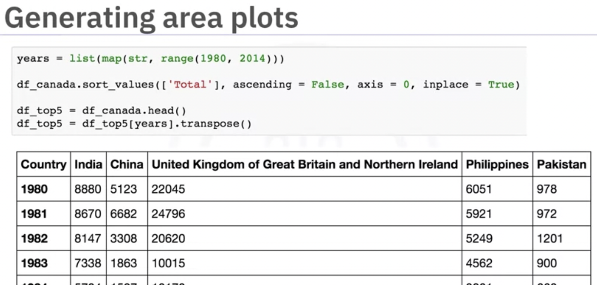
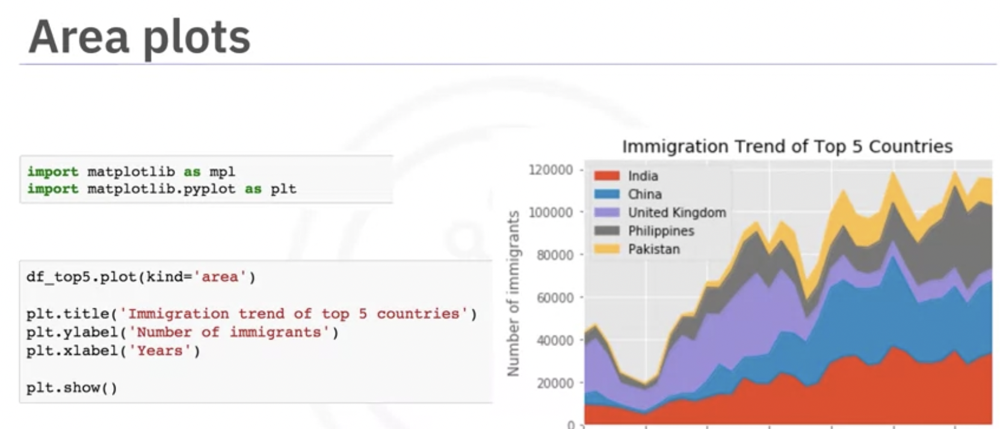
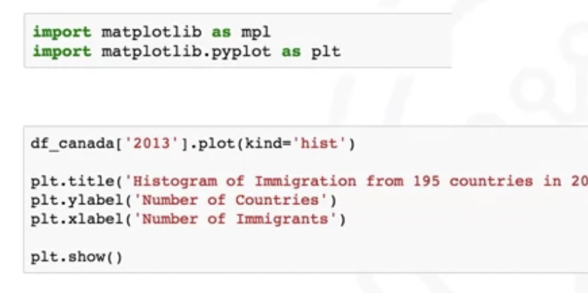
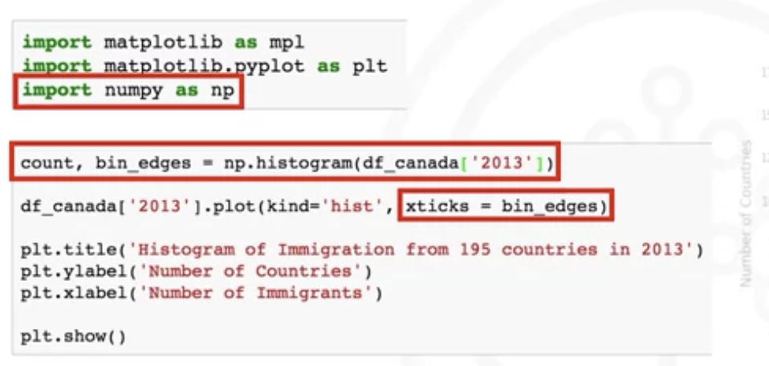
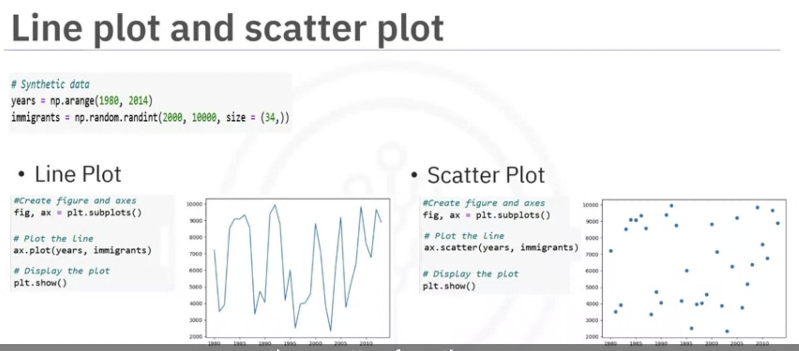

# Data Visualization for Python

## **Module 1** Introduction to Data Visualization Tools

Objectives: **Line, Bar, Scatter, Box, Histograms**

- Discuss data visualization and its importance
- Use Matplotlib libraty to visualize different types of plots

Content: There are various **types of plots** commonly used in data visualization.

- Line Plots: Shows trends and changes over time.
- Bar Plots: Compares categories or groups.
- Scatter Plots: Examines relationships between variables.
- Box Plots: Displays distribution and identifies outliers.
- Histograms: Illustrates data distribution within intervals.

### Plot libraries in Python:

- Matplotlib is a plotting library that offers a wide range of plotting capabilities.
- Pandas is a plotting library that provides Integrated plotting functionalities for data analysis.
- Seaborn is a specialized library for statistical visualizations, offering attractive default aesthetics and color palettes.
- Folium is a Python library that allows you to create interactive and customizable maps.
- Plotly is an interactive and dynamic library for data visualization that supports a wide range of plot types and interactive features.
- PyWaffle enables you to visualize proportional representation using squares or rectangles.

### Matplotlib

- Matplotlib is one of the most widely used data visualization libraries in Python.
- Matplotlib was initially developed as an EEG/ECoG visualization tool.
- Matplotlib's architecture is composed of three main layers:
   Backend layer, Artist layer, and the Scripting layer.
- The anatomy of a plot refers to the different components and elements that make up a visual representation of data.

| Task                          | Syntax                                                      | Description                                                | Example                                                  |
| :---------------------------- | :---------------------------------------------------------- | :--------------------------------------------------------- | :------------------------------------------------------- |
| Load CSV data                 | `pd.read_csv('filename.csv')`                               | Read data from a CSV file into a Pandas DataFrame          | `df_can=pd.read_csv('data.csv')`                         |
| Handling Missing Values       | `df.dropna()`                                               | Drop rows with missing values                              | `df_can.dropna()`                                        |
|                               | `df.fillna(value)`                                          | Fill missing values with a specified value                 | `df_can.fillna(0)`                                       |
| Removing Duplicates           | `df.drop_duplicates()`                                      | Remove duplicate rows                                      | `df_can.drop_duplicates()`                               |
| Renaming Columns              | `df.rename(columns={'old_name': 'new_name'})`               | Rename one or more columns                                 | `df_can.rename(columns={'Age': 'Years'})`                |
| Selecting Columns             | `df['column_name']` or `df.column_name`                     | Select a single column                                     | `df_can.Age` or `df_can['Age]'`                          |
|                               | `df[['col1', 'col2']]`                                      | Select multiple columns                                    | `df_can[['Name', 'Age']]`                                |
| Filtering Rows                | `df[df['column'] > value]`                                  | Filter rows based on a condition                           | `df_can[df_can['Age'] > 30]`                             |
| Applying Functions to Columns | `df['column'].apply(function_name)`                         | Apply a function to transform values in a column           | `df_can['Age'].apply(lambda x: x + 1)`                   |
| Creating New Columns          | `df['new_column'] = expression`                             | Create a new column with values derived from existing ones | `df_can['Total'] = df_can['Quantity'] * df_can['Price']` |
| Grouping and Aggregating      | `df.groupby('column').agg({'col1': 'sum', 'col2': 'mean'})` | Group rows by a column and apply aggregate functions       | `df_can.groupby('Category').agg({'Total': 'mean'})`      |
| Sorting Rows                  | `df.sort_values('column', ascending=True/False)`            | Sort rows based on a column                                | `df_can.sort_values('Date', ascending=True)`             |
| Displaying First n Rows       | `df.head(n)`                                                | Show the first n rows of the DataFrame                     | `df_can.head(3)`                                         |
| Displaying Last n Rows        | `df.tail(n)`                                                | Show the last n rows of the DataFrame                      | `df_can.tail(3)`                                         |
| Checking for Null Values      | `df.isnull()`                                               | Check for null values in the DataFrame                     | `df_can.isnull()`                                        |
| Selecting Rows by Index       | `df.iloc[index]`                                            | Select rows based on integer index                         | `df_can.iloc[3]`                                         |
|                               | `df.iloc[start:end]`                                        | Select rows in a specified range                           | `df_can.iloc[2:5]`                                       |
| Selecting Rows by Label       | `df.loc[label]`                                             | Select rows based on label/index name                      | `df_can.loc['Label']`                                    |
|                               | `df.loc[start:end]`                                         | Select rows in a specified label/index range               | `df_can.loc['Age':'Quantity']`                           |
| Summary Statistics            | `df.describe()`                                             | Generates descriptive statistics for numerical columns     | `df_can.describe()`                                      |


## Module 2: Basic and Specialized Tools

Learn about **area plots, histograms, bar charts, pie charts, box plots, and scatter plots**. You will also explore the process of creating these visualization tools using Matplotlib.





**Histogram**

Represents the **frequency distribution** of a dataset

- Partitions numeric data into bins
- Assigns each data point in the dataset
- Counts the number of data points





### Pie Chart

```python
df_new=df.groupby(['Year','Month'])['Estimated_fire_area'].mean() # groupby "Year", 'Month'
region_counts = df.groupby('Region')['Count'].sum()
plt.pie(region_counts, labels=region_counts.index, autopct='%1.1f%%') #percentage
# from video
df_continents = df_canada.groupby ('Continent', axis = 0).sum () # create a column 'Total'
df_continents["Total"].plot(kind="pie")
#plt.xlabel("")
plt.title("Immigration to Canada by Continent [1980-2013]")
plt.show()
```

- A pie chart is a circular statistical graphic, divided into segments, to illustrate numerical proportion.
- The process of creating a pie chart involves importing Matplotlib to represent a large set of data over a period of time.

### histplot: understand the distribution of an attribution

What if we need to understand the distribution of estimated fire brightness across regions? Let's use the functionality of seaborn and  pass region as hue

```python
sns.histplot(data=df, x="Mean_estimated_fire_brightness", hue="Region")
plt.show()
```

### Folium to Create a Map & Add Multiple Makers to a Map

```python
# define the world map centered around
# Canada with a low zoom level
import folium
canada_map = folium.Map(location=[56.130, -106.35], zoom start=4, tiles="Stamen Toner")
folium.Marker (location= [51.2538,-85.3232], popup='Ontario').add_to(canada_map)

# 1. add multiple makers
australia = folium.Map(location=[-25, 135], zoom_start=4)
for lat, lon, lab in zip(reg.Lat, reg.Lon, reg.region):
    location = [lat, lon]
    folium.Marker(location, popup=lab).add_to(australia)
australia
# 2. Add Maker using feature group
aus_reg = folium.map.FeatureGroup()
# Create a Folium map centered on Australia
Aus_map = folium.Map(location=[-25, 135], zoom_start=4)
# loop through the region and add to feature group
for lat, lng, lab in zip(reg.Lat, reg.Lon, reg.region):
    aus_reg.add_child(
        folium.features.CircleMarker(
            [lat, lng],
            popup=lab,
            radius=5, # define how big you want the circle markers to be
            color='red',
            fill=True,
            fill_color='blue',
            fill_opacity=0.6
        )
    )
# add incidents to map
Aus_map.add_child(aus_reg)

#3. import MarkerCluster
from folium.plugins import MarkerCluster
# Create a MarkerCluster object
marker_cluster = MarkerCluster().add_to(map) # define a MarkerCluster, and add it to map.

locations = [{"location": [45.4215, -75.6989], "popup": "Ottawa"}, {"location": [53.5461, -113.4938], "popup": "Edmonton"}, {"location": [49.2827, -123.1207], "popup": "Vancouver"}]
# Add markers for each location in the List to the MarkerCluster
for loc in locations:
	folium.Marker(location=loc["location"], popup=loc["popup"]).add_to(marker_cluster)

# from folium.plugins import MarkerCluster
# Create a MarkerCluster object
marker_cluster = MarkerCluster().add_to(australia)
# Add markers for each location in the List to the MarkerCluster
for lat, lon, lab in zip(reg.Lat, reg.Lon, reg.region):
    location = [lat, lon]
    folium.Marker(location, popup=lab).add_to(marker_cluster)
australia
```

**Stamen Toner**: exploring river meanders and coastal zones. (follow a winding course)

**Stamen Terrain**: for visualizing hill shading and natural vegetation colors.


**Visualization Tools:** At this point in the course, you know: 

- A pie chart is a circular statistical graphic, divided into segments, to illustrate numerical proportion.
- The process of creating a pie chart involves importing Matplotlib to represent a large set of data over a period of time.
- A box plot is a way of statistically representing given data distribution through five main dimensions.
- The five main dimensions are minimum, first quartile, median, third quartile, and maximum.
- You can create a box plot using Matplotlib.
- A scatter plot displays values pertaining to typically two variables against each other.
- The process of creating a scatter plot involves importing Matplotlib to visualize a large set of data.
- Matplotlib is a versatile plotting library that offers a flexible interface for creating various types of plots.
- Matplotlib’s Pyplot module offers a convenient way to create and customize plots quickly.
- Data Storytelling is the ‘art of storytelling’ that involves creating a narrative around the data.
- Data visualization is an important aspect of data storytelling and involves creating engaging visuals.

Box plot:

In this video, you learned that:

- A box plot is a way of statistically representing given data distribution through five main dimensions.
- The five main dimensions are minimum, first quartile, median, third quartile, and maximum.
- You can create a box plot using Matplotlib.

Scatter plot:

In this video, you learned that:

- A scatter plot displays values pertaining to typically two variables against each other.
- The process of creating a scatter plot using Matplotlib to visualize a large set of data.



| Plot Type    | Description                                                  | Pandas Function                                              | Example                                                      | Visual                                                       |
| :----------- | :----------------------------------------------------------- | :----------------------------------------------------------- | :----------------------------------------------------------- | :----------------------------------------------------------- |
| Line Plot    | Shows trends and changes over time                           | `DataFrame.plot.line()` `DataFrame.plot(kind = ‘line’)`      | `df.plot(x=’year’, y=’sales’, kind=’line’)`                  |  |
| Area Plot    | Displays data series as filled areas, showing the relationship between them | `DataFrame.plot.area()` `DataFrame.plot(kind = ‘area’)`      | `df.plot(kind='area')`                                       |  |
| Histogram    | Displays bars representing the data count in each interval/bin | `Series.plot.hist()` `Series.plot(kind = ‘hist’, bins = n)`  | `s.plot(kind='hist', bins=10)` `df[‘age’].plot(kind='hist', bins=10)` |  |
| Bar Chart    | Displays data using rectangular bars                         | `DataFrame.plot.bar()` `DataFrame.plot(kind = ‘bar’)`        | `df.plot(kind='bar')`                                        |  |
| Pie Chart    | Displays data as a circular plot divided into slices, representing proportions or percentages of a whole | `Series.plot.pie()` `Series.plot(kind = ‘pie’)` `DataFrame.plot.pie(y, labels)` `DataFrame.plot(kind = ‘pie’)` | `s.plot(kind='pie’,autopct='%1.1f%%')` `df.plot(x='Category',y='Percentage',kind='pie')` |  |
| Box Plot     | Displays the distribution of a dataset along with key statistical measures | `DataFrame.plot.box()` `DataFrame.plot(kind = ‘box’)`        | `df_can.plot(kind='box')`                                    |  |
| Scatter Plot | Uses Cartesian coordinates to display values for two variables | `DataFrame.plot.scatter()` `DataFrame.plot(x, y, kind = ‘scatter’)` | `df.plot(x='Height', y='Weight', kind='scatter')`            |  |

# Plotting directly with Matplotlib

| Plot Type     | Description                                                  | Matplotlib Function   | Example                                                      | Visual                                                       |
| :------------ | :----------------------------------------------------------- | :-------------------- | :----------------------------------------------------------- | :----------------------------------------------------------- |
| Line Plot     | Shows trends and changes over time                           | `plt.plot()`          | `plt.plot(x, y, color='red', linewidth=2)`                   |  |
| Area Plot     | Display data series as filled areas                          | `plt.fill_between()`  | `plt.fill_between(x, y1, y2, color='blue', alpha=0.5)`       |  |
| Histogram     | Displays bars representing the data count in each interval/bin | `plt.hist()`          | `plt.hist(data, bins=10, color='orange', edgecolor='black')` |  |
| Bar Chart     | Displays data using rectangular bars                         | `plt.bar()`           | `plt.bar(x, height, color='green', width=0.5)`               |  |
| Pie Chart     | Displays data as a circular plot divided into slices, representing proportions or percentages of a whole | `plt.pie()`           | `plt.pie(sizes, labels=labels, colors=colors, explode=explode)` |  |
| Box Plot      | Displays the distribution of a dataset along with key statistical measures | `plt.boxplot()`       | `plt.boxplot(data, notch=True)`                              |  |
| Scatter Plot  | Uses Cartesian coordinates to display values for two variables | `plt.scatter()`       | `plt.scatter(x, y, color='purple', marker='o', s=50)`        |  |
| Subplotting   | Creating multiple plots on one figure                        | `plt.subplots()`      | `fig, axes = plt.subplots(nrows=2, ncols=2)`                 |  |
| Customization | Customizing plot: adding labels, title, legend, grid         | Various customization | `plt.title('Title')` `plt.xlabel('X Label')` `plt.ylabel('Y Label')` `plt.legend()` `plt.grid(True)` |  |

## Module 3: Advanced Visualizations and Geospatial Data

Learn about geographic maps, waffle charts (grid present portions), seaborn library.


## Module 4: Creating Dashboards with Plotly and Dash

### Introduction to Plot

```python
#Using plotly. graph, objects

# Import required packages
import plotly.graph_objects as go import plotly.express as px import numpy as np
# Set random seed for reproducibility
np.random.seed(10)
× = np.arange(12)
# Create random y values
y = np.random.randint(50, 500, size=12)

fig = go.Figure(data=go.Scattet(x=x, y=y))
fig.update_layout(title='Simple Line Plot', xaxis_title='Month', yaxis_title='Sales") fig.show()
# Entire line chart can be created in a single command
fig = px.line(x=x, y=y, title='Simple Line Plot', labels=dict(x='Month', y='Sales'))
fig.show()
```

In this video, you learned that:

- Plotly is an interactive, open-source plotting library that supports over 40 unique chart types.
- Plotly graph objects is a low-level interface to figures, traces, and layout.
- Plotly **express** is a **high-level** wrapper for Plotly. It uses graph objects internally.

**Plotly resource:**

[Plotly python](https://plotly.com/python/getting-started/)

[Plotly graph objects with example](https://plotly.com/python/graph-objects/)

[Plotly express](https://plotly.com/python/plotly-express/)

[API reference](https://plotly.com/python-api-reference/)

Here are additional useful resources:

[Plotly cheatsheet](https://images.plot.ly/plotly-documentation/images/plotly_js_cheat_sheet.pdf)

[Plotly community](https://community.plotly.com/c/api/5)

[Related blogs](https://plotlygraphs.medium.com/)

[Open-source datasets](https://developer.ibm.com/exchanges/data/) 

**Dashboard**:

[Python dashboarding tools ](https://pyviz.org/dashboarding/) 

[John Snow's data journalism](https://www.theguardian.com/news/datablog/2013/mar/15/john-snow-cholera-map)

### Introduction to Dash

- Open-source User Interface Python library from Plotly
- Easy to build GUI
- Declarative and Reactive
- Rendered in a web browser and can be deployed to servers
- Inherently cross-platform and mobile ready

Core Components

- Higher-level components that are interactive and are generated with JavaScript, HTML, and CSS through the React.js library
- Example: Creating a slider, input area, check items, datepicker, and other components

#### Summary

- Dash is an Open-Source User Interface Python library for creating reactive, web-based applications.
   It is easy to build Graphical User Interfaces using Dash as it abstracts all technologies required to make the applications.
- There are two components of Dash: Core and HTML components.
- The dash_core_components describe higher-level interactive components generated with JavaScript, HTML, and CSS through the React.js library.
- The dash html components library has a component for every HTML tag.

**Dash Resources:**

To learn more about Dash, explore

[Complete dash user guide](https://dash.plotly.com/)

[Dash core components](https://dash.plotly.com/dash-core-components)

[Dash HTML components](https://dash.plotly.com/dash-html-components)

[Dash community forum](https://community.plotly.com/c/python/25)

[Related blogs](https://medium.com/plotly/tagged/dash)

### Make Dash Interactive - Callback function

```python
import pandas as pd import plotly.express as px import dash
import dash_htm1_components as html 
import dash_core_components as dcc 
from dash. dependencies import Input, Output
# Read the data
airline_data = pd.read_csv('airline_2m.csv', encoding = "ISO-8859-1",
								dtype={'DivlAirport': str, 'DiviTailNum': str,
											'Div2Airport': str, 'DivaTailNum': str})
app = dash.Dash ()
# Design dash app layout
app.layout = html.Div(children=[ html.H1('Airline Dashboard', style={'textAlign': 'center', 											'color': colors['text'], 'font-size': 40}), 
                                htmI.Div (['Input: ', dcc.Input(id='input-yr', value='2010', 												type='number', style={'height': '50px', 'font-size': 35}),], style=												{'font-size': 40}), html.Br(), html.Br(),
												html.Div(dcc.Graph(id='bar-plot')), ])
@app.callback( Output (component_id='bar-plot', component_property='figure'),
Input(component_id='input-yr', component_property='value'))
def get_graph (entered_year):
	# Select data
	df = airline_data[airline_data ['Year']==int (entered_year)]
	# Top 10 airline carrier in terms of number of flights
	g1 = df. groupby (['Reporting_Airline']) ['Flights'].sum().nlargest (10). reset_index ()
	# Plot the graph
	figl = px.bar(g1, x='Reporting_Airline', y='Flights', title='Top 10 airline carrier in year' + str(entered_year) + ' in terms of number of flights')
	fig1.update_layout()
	return fig1
if __name__ == '__main__':
	app.run_server (port=8002, host='127.0.0.1', debug=True)
```


### Summarize

- Dash is an Open-Source User Interface Python library for creating reactive, web-based applications.
- It is easy to build Graphical User Interfaces using Dash as it abstracts all technologies required to make the applications.
- There are two components of Dash: Core and HTML components.
- The dash_core_components describe higher-level interactive components generated with JavaScript, HTML, and CSS through the React.js library.
- The dash_html_components library has a component for every HTML tag.
- A callback function is a python function that is automatically called by Dash whenever an input component's property changes.
- The @app.callback decorator decorates the callback function in order to tell Dash to call it whenever there is a change in the input component value.
- The callback function takes input and output components as parameters and performs operations to return the desired result for the output component.

## Project

### Tasks to be performed

TASK 1.1: To understand the change in average estimated fire area over time using pandas to plot the line chart.

TASK 1.2 To plot the estimated fire area over month

TASK 1.3 Use the functionality of seaborn to develop a barplot, to find the insights on the distribution of mean estimated fire brightness across the regions

TASK 1.4 Develop a pie chart and find the portion of count of pixels for presumed vegetation fires vary across regions

TASK 1.5 Customize the previous pie plot for a better visual representation

TASK 1.6 Use Matplotlib to develop a histogram of the mean estimated fire brightness

TASK 1.7 Use the functionality of seaborn and pass region as hue, to understand the distribution of estimated fire brightness across regions

TASK 1.8 Develop a scatter plot to find the correlation between mean estimated fire radiative power and mean confidence level

TASK 1.9 Mark all seven regions affected by wildfires, on the Map of Australia using Folium

------

### Part 2 : Dashboard to display charts based on selected Region and Year

#### Objective:

The objective of this part of the practice assignment is to create dashboards to contain your plots and charts.

In this lab you will create dashboards using *Dash and Plotly* and then add user-interactions to your dashboards.

------

You will be required to create a dashboard wherein the user can select the `Region` and the `Year`. Based on the selection, the dashboard will display the following two charts:-

1. Pie Chart on Monthly Average Estimated Fire Area
2. Bar Chart on Monthly Average Count of Pixels for Presumed Vegetation Fires

### Tasks to be performed

TASK 2.1 Add title to the dashboard

TASK 2.2 Add the radio items and a dropdown right below the first inner division

TASK 2.3 Add two empty divisions for output inside the next inner division

TASK 2.4 Add the Ouput and input components inside the app.callback decorator

TASK 2.5 Add the callback function


Which layer within the Matplotlib architecture generates graphics and plots quickly and easily?

The scripting layer is the appropriate layer for everyday purposes. It is considered a lighter scripting interface to simplify common tasks and for a quick and easy generation of graphics and plots.

**Waffle charts** are a visualization technique that represents categorical data in the form of square tiles or cells. These resemble a grid of equal-sized squares, with each square representing a specific value or category.

Which tool depicts the importance of different words in the body of text? **word cloud**

 **Histograms** illustrate data distribution within specific intervals, allowing us to understand its shape and concentration.


Question 4

Using Matplotlib magic functions which code starts the command: %matplotlib

