# Machine Learning

### Major machine learning techniques

- Regression/Estimation
  - Predicting continuous values
- Classification
  - Predicting the item class/category of a case
- Clustering
  - Finding the structure of data; summarization
- Associations
  - Associating frequent co-occurring items/events

### K-Nearest Neighbors algorithm

 kNN can be used for both classification and regression prediction tasks. In the case of a continuous target, the prediction is taken as the average or median of the nearest neighbours.

- In classification, it assigns the majority class among the k-nearest neighbors to a new data point. 
- In regression, it predicts a continuous value based on the average or weighted average of the k-nearest neighbors.

## Classification Accuracy:

### 1. Jaccard Index:

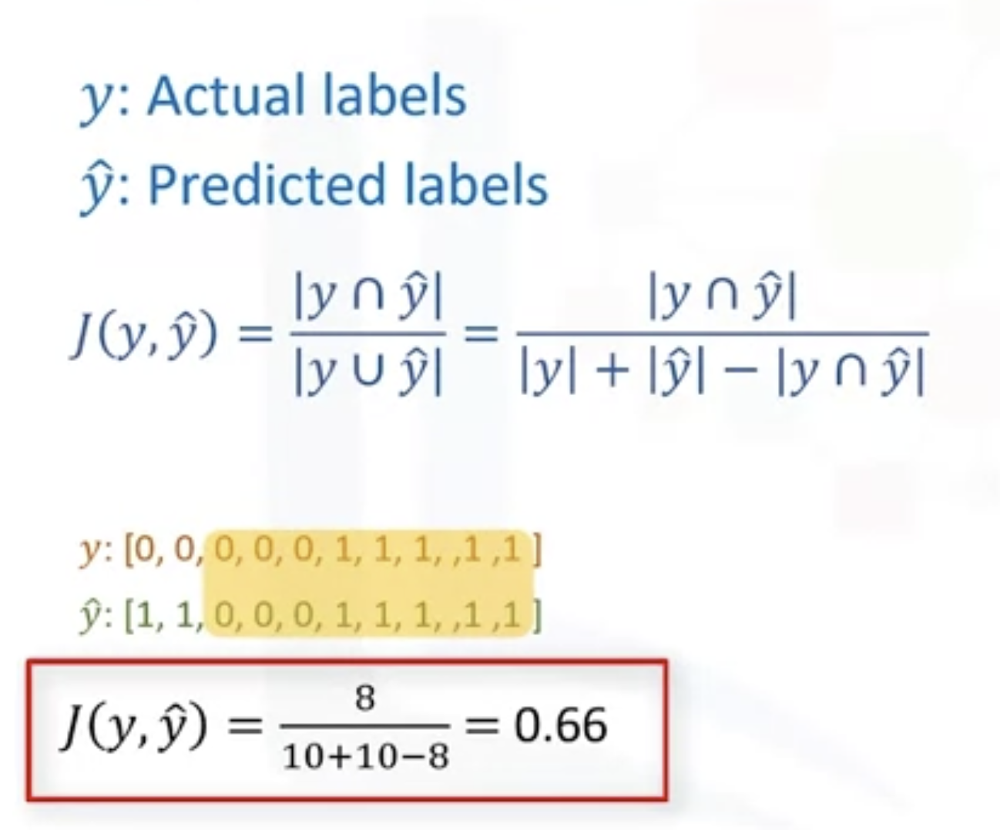

### 2. F1-Score: Confusion matrix

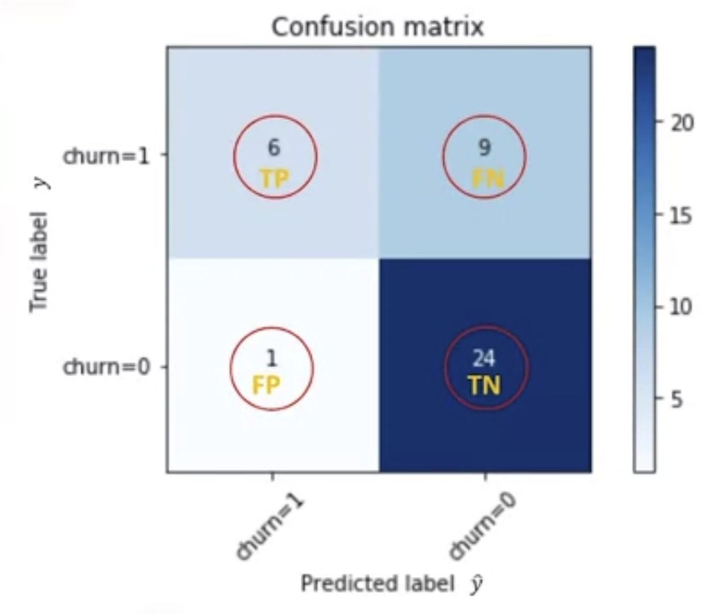

TP: True Positive; FN: False Negative

Prediction = TP / (TP + FP)

Recall = TP / (TP + FN)

F1 = 2 * (Prediction * Recall) / (Prc + Rec)

The F1 score is the harmonic average of the precision and recall, where an F1 score reaches 

its best value at 1 (which represents perfect precision and recall) and its worst at 0. 

### 3. Log loss

Performance of a classifier where the predicted output is a probability value between 0 and 1.

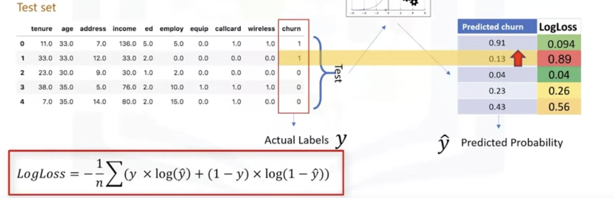

## Decision Tree Algorithm

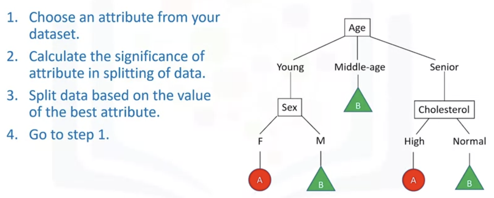

Decision Tree uses **recursive partitioning** to split the training records into segments by minimizing the impurity at each step. (递归分割法) 

**Impurity of nodes** is calculated by entropy of data in the node. 

**Entropy** is the amount of information disorder or the amount of randomness in the data. (熵是数据中无序信息量或随机性量)

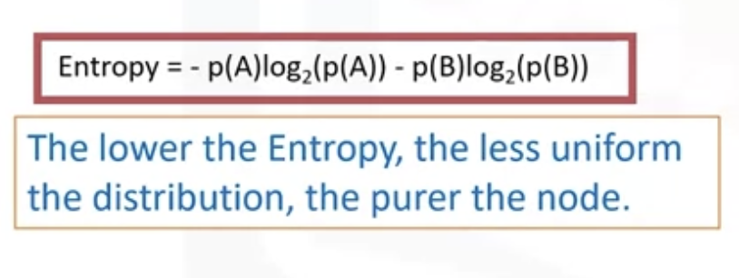

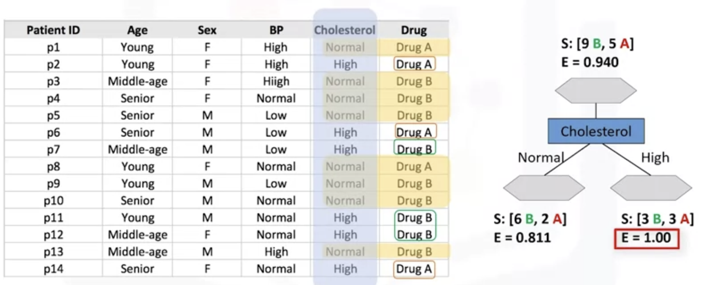

We should go through all the attributes and calculate the entropy and get the best attributes.

Information gain is the information that can increase the level of certainty after splitting.

#### Entropy and Information Gain:

When information gain Increases, the entropy decreases.

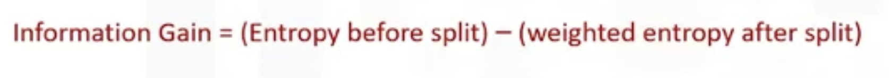

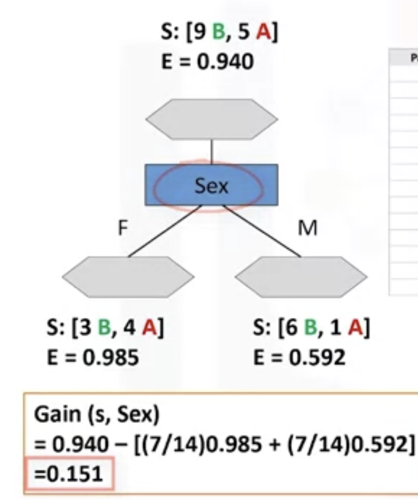

## Logistic Regression

Logistic Regression is to predict categorical data or discrete data instead of numerical data.

- Binary classification
- Multi-classification

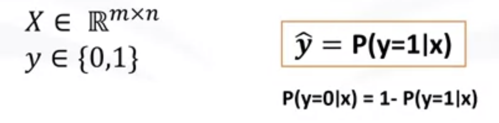

### Sigmoid - Logistic Function:

sigmoid of Theta transpose x gives us the probability of a point **belonging to a class** instead of the value of y directly. 

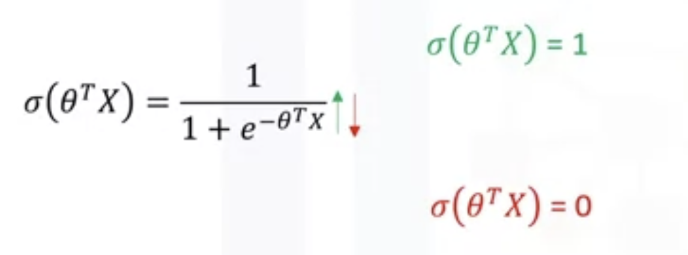

 

In logistic regression, we model the probability that an input, x, belongs to the default class y equals 1, 

and we can write this formally as probability of y equals 1 given x. **P(y=1 | x)**

We can also write probability of y belongs to class 0 given x is 1 minus probability of y equals 1 given x. 

How to change the value of theta? by **Gradient descent**. 

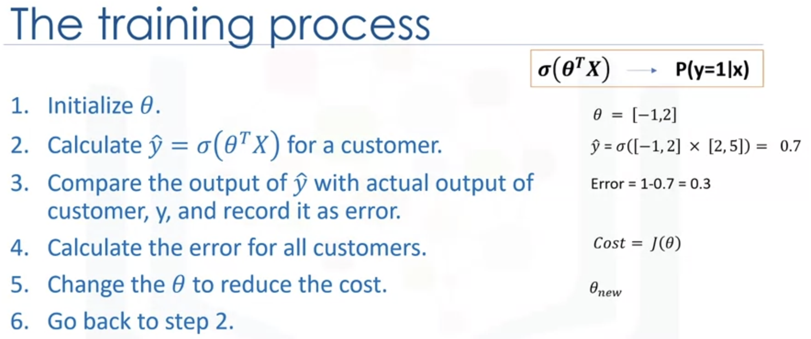

### Cost function

global minimum

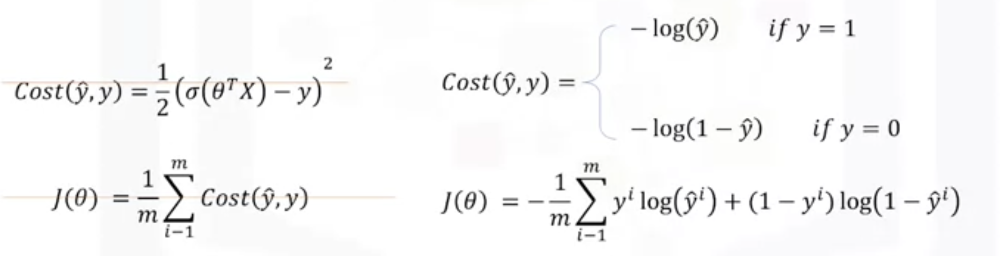

#### Minimizing the cost function of the model

## SVM: Supporter Vector Machine

Kernelling: Transform the original data into different dimensions

- Linear
- Polynomial
- RBF
- Sigmoid

Using SVM to find the opitmal hyperplane

1. **Objective:** SVM aims to find a hyperplane in an N-dimensional space (where N is the number of features) that distinctly classifies data points into different classes. For binary classification, the hyperplane separates the data into two classes, and for multi-class classification, multiple hyperplanes are used.
2. **Margin:** The optimal hyperplane is the one that **maximizes** **the margin**, which is the distance between the hyperplane and the nearest data points from each class. SVM is often referred to as a maximum-margin classifier.
3. **Support Vector**:  is a data point that is instrumental in defining the decision boundary (hyperplane) between different classes. The support vectors are the instances that lie **closest to the decision boundary**, and they play a **crucial role in determining the optimal hyperplane.**

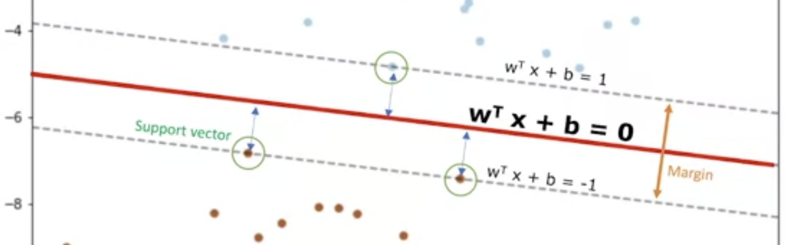

### Pros and Cons of SVM

Advantages:

- Accurate in high-dimensional spaces
- Memory efficient

Disadvantages:

- Prone to over-fitting (When No. of the features is much greater than the No. of the samples )
- No probability estimation
- Not efficient when the data is big

#### SVM application: good at dealing with high dimensional data.

- Image recognition
- Text category assignment
- Detecting spam
- Sentiment analysis
- Gene Expression Classification
- Regression, outlier detection and clustering

## K-Means

How is a center point (**centroid**) picked for each cluster in k-means upon **initialization**?

- We can create some random points as centroids of the clusters.

- We can randomly place k centroids, one for each cluster. Each data point is then assigned to its closest centroid.

####  Three distinct types of clustering algorithms

1. **Partition-Based Clustering:** 

   - **Example Algorithm:** K-Means, K-Medoids
   - **Basic Idea:** Divides the dataset into non-overlapping subsets or clusters.
   - **How it Works:** Iteratively assigns data points to clusters and adjusts cluster centroids or medoids to minimize the within-cluster sum of distances.
   - **Advantages:** Efficient and scalable for large datasets, works well with globular clusters.
   - **Disadvantages:** Sensitive to initial cluster centers, may not handle non-globular shapes well.
   - **Partition-based clustering produces sphere-like clusters.**

   This statement is generally correct, particularly in the context of algorithms like K-Means, which tends to create spherical or isotropic clusters.

2. **Hierarchical Clustering:**

   - **Example Algorithm:** Agglomerative, Divisive
   - **Basic Idea:** Creates a tree of clusters (dendrogram) representing a hierarchy of nested clusters.
   - **How it Works:** Agglomerative starts with individual data points as clusters and merges them iteratively, while divisive starts with one cluster and splits it until each data point is its own cluster.
   - **Advantages:** Provides a hierarchy of clusters, doesn't require specifying the number of clusters beforehand.
   - **Disadvantages:** Computationally intensive for large datasets, harder to interpret for a large number of data points.

3. **Density-Based Clustering:**

   - **Example Algorithm:** DBSCAN (Density-Based Spatial Clustering of Applications with Noise)
   - **Basic Idea:** Identifies clusters based on areas of higher data point density separated by areas of lower density.
   - **How it Works:** Groups data points that are close to each other and have a minimum number of neighbors within a specified distance.
   - **Advantages:** Can discover clusters of arbitrary shapes, robust to noise and outliers.
   - **Disadvantages:** Sensitive to parameter settings, may struggle with varying density clusters.

In summary, partition-based clustering divides the dataset into non-overlapping subsets, hierarchical clustering builds a tree of nested clusters, and density-based clustering identifies clusters based on areas of higher data point density. The choice of which algorithm to use depends on the nature of the data and the specific requirements of the clustering task.

When K increases, **It will decrease because the distance between data points and centroids will decrease.**

As the parameter K (the number of clusters) increases in k-means clustering, the algorithm tends to create more clusters, which can result in smaller and more compact clusters. This, in turn, reduces the average distance between data points and their respective cluster centroids, leading to a decrease in the error or the within-cluster sum of squares (WCSS).