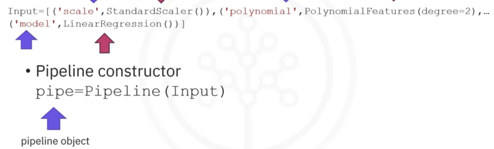
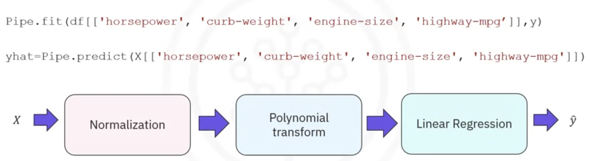

# Tools for DS

## Module 1: Overview of Data Science Tools  

In this module, you will learn about the different types and categories of tools that data scientists use and popular examples of each. You will also become familiar with Open Source,  Cloud-based,  and Commercial options for data science tools.

Congratulations! You have completed this module. At this point in the course, you know:

- The Data Science Task Categories include:
  - Data Management -  storage, management and retrieval of data
  - Data Integration and Transformation - streamline data pipelines and automate data processing tasks
  - Data Visualization - provide graphical representation of data and assist with communicating insights
  - Modelling - enable Building, Deployment, Monitoring and Assessment of Data and Machine Learning models
- Data Science Tasks support the following:
  - Code Asset Management - store & manage code, track changes and allow collaborative development
  - Data Asset Management - organize and manage data, provide access control, and backup assets
  - Development Environments - develop, test and deploy code
  - Execution Environments - provide computational resources and run the code

The data science ecosystem consists of many open source and commercial options, and include both traditional desktop applications and server-based tools, as well as cloud-based services that can be accessed using web-browsers and mobile interfaces.

**Data Management Tools**: include Relational Databases, NoSQL Databases, and Big Data platforms:

- MySQL, and PostgreSQL are examples of Open Source Relational Database Management Systems (RDBMS), and IBM Db2 and SQL Server are examples of commercial RDBMSes and are also available as Cloud services.
- MongoDB and Apache Cassandra are examples of NoSQL databases.
- Apache Hadoop and Apache Spark are used for Big Data analytics. 

**Data Integration and Transformation Tools:** include Apache Airflow and Apache Kafka. 

**Data Visualization Tools:**  include commercial offerings  such as Cognos Analytics, Tableau and PowerBI  and can be used for building dynamic and interactive dashboards.  

**Code Asset Management Tools:** Git is an essential code asset management tool. GitHub is a popular web-based platform for storing and managing source code. Its features make it an ideal tool for collaborative software development, including version control, issue tracking, and project management. 

**Development Environments:** Popular development environments for Data Science include Jupyter Notebooks and RStudio. 

- Jupyter Notebooks provides an interactive environment for creating and sharing code, descriptive text, data visualizations, and other computational artifacts in a web-browser based interface.  
- RStudio is an integrated development environment (IDE) designed specifically for working with the R programming language, which is a popular tool for statistical computing and data analysis.





### Measures for in-sample evaluation

- Measure how well the model fits our data

- Two important measures to determine the fit of a model:

  - **Mean Squared Error (MSE)**
  - **R-squared (R2)**

  1. **Definition:** R-squared is the square of the correlation coefficient between the observed values of the dependent variable and the values predicted by the regression model.

  2. **Range:** R-squared values range from 0 to 1. A value of 0 indicates that the model does not explain any variability in the dependent variable, while a value of 1 indicates that the model perfectly explains the variability.

  3. **Interpretation:** A higher R-squared value indicates a better fit of the model to the data. However, a high R-squared does not necessarily imply causation or the absence of omitted variable bias.

  4. **Calculation:** R-squared is calculated using the formula: 

     $$R^2=1− (Sum of Squares of Residuals / Total Sum of Squares) $$

### Model Development

```python
# Linear Regression	Create a Linear Regression model object	

from sklearn.linear_model import LinearRegression
lr = LinearRegression()

#Train Linear Regression model	Train the Linear Regression model on decided data, separating Input and Output attributes. When there is single attribute in input, then it is simple linear regression. When there are multiple attributes, it is multiple linear regression.	

X = df[[‘attribute_1’, ‘attribute_2’, ...]]
Y = df['target_attribute']
lr.fit(X,Y)

#Generate output predictions	Predict the output for a set of Input attribute values.	
Y_hat = lr.predict(X)

#Identify the coefficient and intercept	Identify the slope coefficient and intercept values of the linear regression model defined by  Where m is the slope coefficient and c is the intercept.	

coeff = lr.coef
intercept = lr.intercept_

#Residual Plot	This function will regress y on x (possibly as a robust or polynomial regression) and then draw a scatterplot of the residuals.	

import seaborn as sns 
sns.residplot(x=df[[‘attribute_1’]], 
y=df[[‘attribute_2’]])

#Distribution Plot	This function can be used to plot the distribution of data w.r.t. a given attribute.	

import seaborn as sns  
sns.distplot(df['attribute_name'], hist=False)
# can include other parameters like color, label and so on.

Polynomial Regression	Available under the numpy package, for single variable feature creation and model fitting.	

f = np.polyfit(x, y, n)
#creates the polynomial features of order n
p = np.poly1d(f)
#p becomes the polynomial model used to generate the predicted output
Y_hat = p(x)
# Y_hat is the predicted output

#Multi-variate Polynomial Regression	Generate a new feature matrix consisting of all polynomial combinations of the features with the degree less than or equal to the specified degree.	
from sklearn.preprocessing import PolynomialFeatures
Z = df[[‘attribute_1’,’attribute_2’,...]] 
pr=PolynomialFeatures(degree=n)
Z_pr=pr.fit_transform(Z)

#Pipeline	Data Pipelines simplify the steps of processing the data. We create the pipeline by creating a list of tuples including the name of the model or estimator and its corresponding constructor.	
from sklearn.pipeline import Pipeline
from sklearn.preprocessing import StandardScaler
Input=[('scale',StandardScaler()), ('polynomial',
PolynomialFeatures(include_bias=False)), 
('model',LinearRegression())]
pipe=Pipeline(Input)
Z = Z.astype(float)
pipe.fit(Z,y)
ypipe=pipe.predict(Z)

#R^2 value	R^2, also known as the coefficient of determination, is a measure to indicate how close the data is to the fitted regression line. The value of the R-squared is the percentage of variation of the response variable (y) that is explained by a linear model.
# a. For Linear Regression (single or multi attribute)
# b. For Polynomial regression (single or multi attribute)
X = df[[‘attribute_1’, ‘attribute_2’, ...]]
Y = df['target_attribute']
lr.fit(X,Y)
R2_score = lr.score(X,Y)

from sklearn.metrics import r2_score
f = np.polyfit(x, y, n)
p = np.poly1d(f)
R2_score = r2_score(y, p(x))

#MSE value	The Mean Squared Error measures the average of the squares of errors, that is, the difference between actual value and the estimated value.	
from sklearn.metrics import mean_squared_error
mse = mean_squared_error(Y, Yhat)

```


 At this point in the course, you know: 

- Linear regression refers to using one independent variable to make a prediction.
- You can use multiple linear regression to explain the relationship between one continuous target y variable and two or more predictor x variables.
- Simple linear regression, or SLR, is a method used to understand the relationship between two variables, the predictor independent *variable x* and the target dependent *variable y*.
- Use the **regplot** and **residplot** functions in the Seaborn library to create regression and residual plots, which help you identify the strength, direction, and linearity of the relationship between your independent and dependent variables.
- When using residual plots for model evaluation, residuals should ideally have zero mean, appear evenly distributed around the x-axis, and have consistent variance. If these conditions are not met, consider adjusting your model.
- Use distribution plots for models with multiple features: Learn to construct distribution plots to compare predicted and actual values, particularly when your model includes more than one independent variable. Know that this can offer deeper insights into the accuracy of your model across different ranges of values.
- The order of the polynomials affects the fit of the model to your data. Apply Python's **polyfit** function to develop polynomial regression models that suit your specific dataset.
- To prepare your data for more accurate modeling, use feature transformation techniques, particularly using the **preprocessing** library in scikit-learn, transform your data using polynomial features, and use the modules like **StandardScaler** to normalize the data.
- Pipelines allow you to simplify how you perform transformations and predictions sequentially, and you can use pipelines in scikit-learn to streamline your modeling process.
- You can construct and train a pipeline to automate tasks such as normalization, polynomial transformation, and making predictions.
- To determine the fit of your model, you can perform sample evaluations by using the Mean Square Error (MSE), using Python’s **mean_squared_error** function from scikit-learn, and using the score method to obtain the R-squared value.
- A model with a high R-squared value close to 1 and a low MSE is generally a good fit, whereas a model with a low R-squared and a high MSE may not be useful.
- Be alert to situations where your R-squared value might be negative, which can indicate overfitting. 
- When evaluating models, use visualization and numerical measures and compare different models.
- The mean square error is perhaps the most intuitive numerical measure for determining whether a model is good.
- A distribution plot is a suitable method for multiple linear regression.
- An acceptable r-squared value depends on what you are studying and your use case.
- To evaluate your model’s fit, apply visualization, methods like regression and residual plots, and numerical measures such as the model's coefficients for sensibility: 
- Use Mean Square Error (MSE) to measure the average of the squares of the errors between actual and predicted values and examine R-squared to understand the proportion of the variance in the dependent variable that is predictable from the independent variables.
- When analyzing residual plots, residuals should be randomly distributed around zero for a good model. In contrast, a residual plot curve or inaccuracies in certain ranges suggest non-linear behavior or the need for more data.

### Model Refinement

```python
#Splitting data for training and testing	The process involves first separating the target attribute from the rest of the data. Treat the target attribute as the output and the rest of the data as input. Now split the input and output datasets into training and testing subsets.	

from sklearn.model_selection import train_test_split
y_data = df['target_attribute']
x_data=df.drop('target_attribute',axis=1)
x_train, x_test, y_train, y_test = train_test_split(x_data, y_data, test_size=0.10, random_state=1)

# Cross validation score	Without sufficient data, you go for cross validation, which involves creating different subsets of training and testing data multiple times and evaluating performance across all of them using the R2 value.	
from sklearn.model_selection import cross_val_score
from sklearn.linear_model import LinearRegression lre=LinearRegression()
Rcross = cross_val_score(lre,x_data[['attribute_1']],y_data,cv=n)  
# n indicates number of times, or folds, for which the cross validation is to be done
Mean = Rcross.mean()
Std_dev = Rcross.std()

# Cross validation prediction	Use a cross validated model to create prediction of the output.	
from sklearn.model_selection import cross_val_score
from sklearn.linear_model import LinearRegression 
lre=LinearRegression()
yhat = cross_val_predict(lre,x_data[['attribute_1']], y_data,cv=4)

#Ridge Regression and Prediction	To create a better fitting polynomial regression model, like , one that avoids overfitting to the training data, we use the Ridge regression model with a parameter alpha that is used to modify the effect of higher-order parameters on the model prediction.	
from sklearn.linear_model import Ridge
pr=PolynomialFeatures(degree=2) x_train_pr=pr.fit_transform(x_train[['attribute_1', 'attribute_2', ...]])
x_test_pr=pr.fit_transform(x_test[['attribute_1', 'attribute_2',...]])
RigeModel=Ridge(alpha=1)
RigeModel.fit(x_train_pr, y_train)
yhat = RigeModel.predict(x_test_pr)

#Grid Search	Use Grid Search to find the correct alpha value for which the Ridge regression model gives the best performance. It further uses cross-validation to create a more refined model.	
from sklearn.model_selection import GridSearchCV
from sklearn.linear_model import Ridge
parameters= [{'alpha': [0.001,0.1,1, 10, 100, 1000, 10000, ...]}]
RR=Ridge()
Grid1 = GridSearchCV(RR, parameters1,cv=4) 
Grid1.fit(x_data[['attribute_1', 'attribute_2', ...]], y_data)
BestRR=Grid1.best_estimator_
BestRR.score(x_test[['attribute_1', 'attribute_2', ...]], y_test)
```


## Module 2: Languages of Data Science

This module will bring awareness about the criteria determining which language you should learn. You will learn the benefits of Python, R, SQL, and other common languages such as Java, Scala, C++, JavaScript, and Julia. You will explore how you can use these languages in Data Science. You will also look at some sites for more information about the languages. 

### Learning Objectives

- Identify the criteria and roles for determining the language to learn.
- Identify the users and benefits of Python.
- Identify the users and uses of the R language.
- Define SQL elements and list their benefits.
- Review languages such as Java, Scala, C++, JavaScript, and Julia.
- List the global communities for connecting with other users.